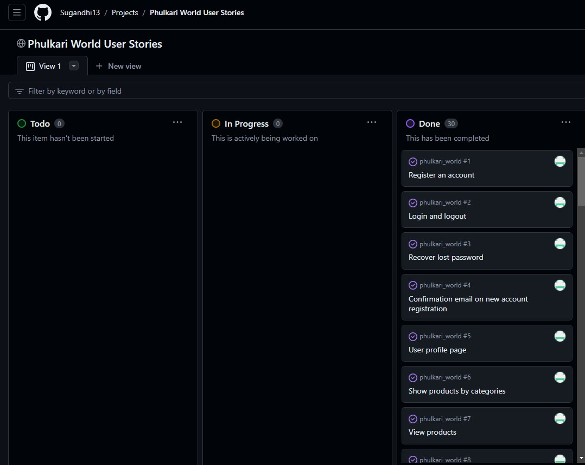
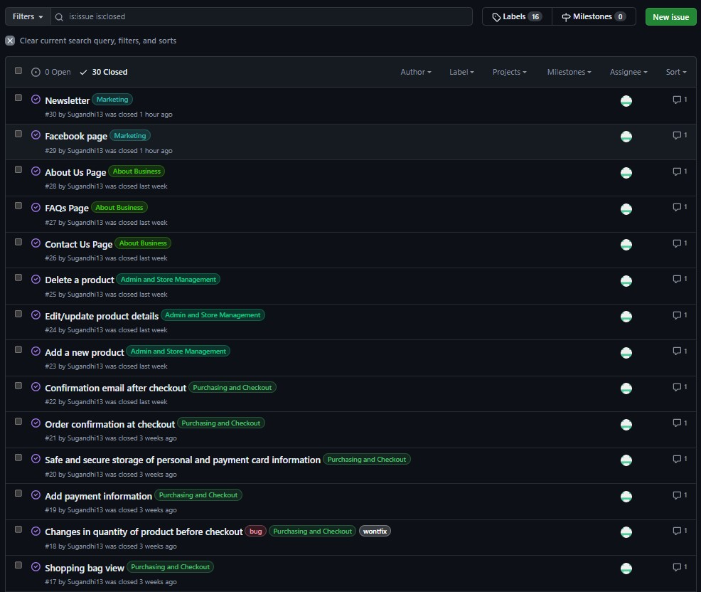
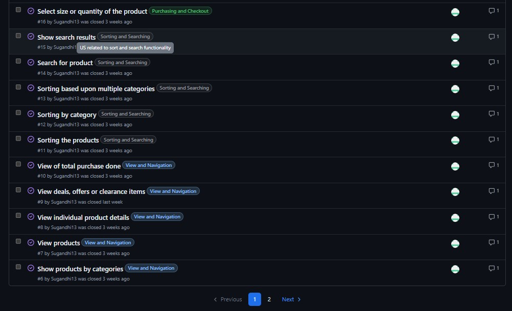
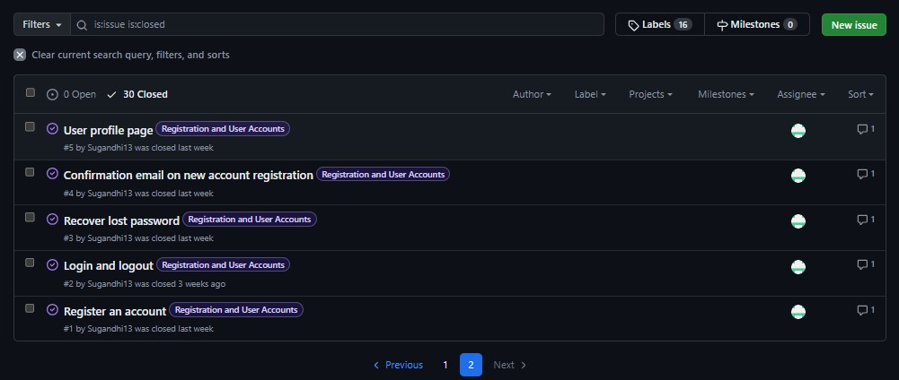
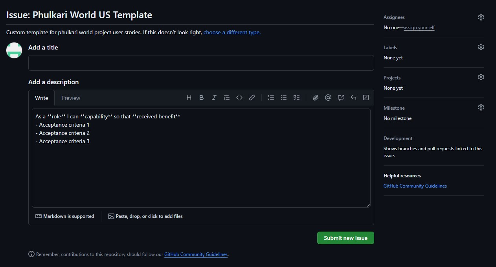
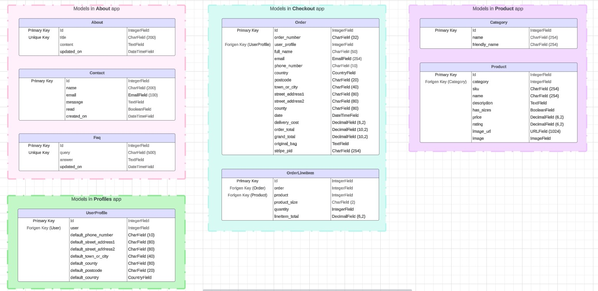
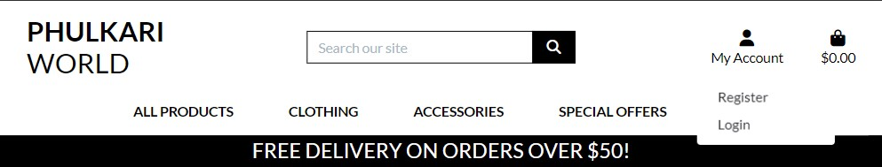
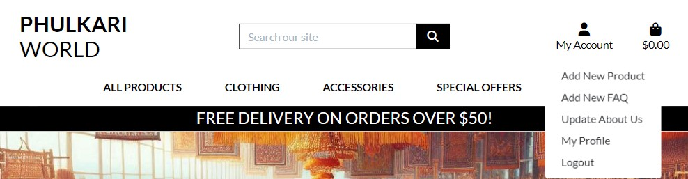
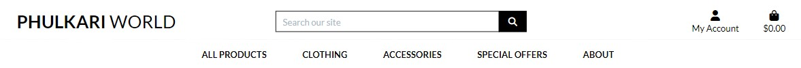
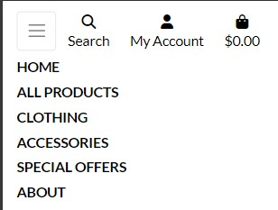

# Phulkari World!

Phulkari World is an e-commerce website. It provides its customer an option to celebrate the vibrant heritage of Punjab by buying exquisite collection of traditional and contemporary fashion clothing and accessorices called as **Phulkari**.

# AmIResponsive


- Phulkari World! is live, to access it <a href="https://phulkari-world-3ca4f249daad.herokuapp.com/" target="_blank">click here.</a>
- Git Hub Repository [Phulkari World!](https://github.com/Sugandhi13/phulkari_world.git)

# Table Of Contents

+ [Phulkari World!](#phulkari-world)
+ [AmIResponsive](#amiresponsive)
+ [Table Of Contents](#table-of-contents)
+ [UX](#ux)
    + [Site Purpose](#site-purpose)
    + [Audience](#audience)
    + [Current User Goals](#current-user-goals)
    + [Future User Goals](#future-user-goals)
+ [Design](#design)
    + [Color Scheme](#color-scheme)
    + [Typography](#typography)
    + [Agile Methodology](#agile-methodology)
        + [Kanban Board](#kanban-board)
        + [User Stories](#user-stories)
        + [User Story Template](#user-story-template)
    + [Wireframes](#wireframes)
    + [Project Structure](#project-structure)
    + [Database Schema](#database-schema)
        + [Category](#category)
        + [Query](#query)
        + [Answer](#answer)
        + [UserProfile](#userprofile)
        + [About](#about)
        + [Contact](#contact)
+ [Features](#features)
    + [Common Features](#common-features)
        + [Language Used](#language-used)
        + [Navbar](#navbar)
        + [Footer](#footer)
        + [Index](#index)
        + [About Us](#about-us)
        + [Contact Us](#contact-us)
        + [Ask a Query](#ask-a-query)
        + [Write an Answer](#write-an-answer)
        + [Sign Up](#sign-up)
        + [Log In](#log-in)
        + [Log Out](#log-out)
        + [Profile](#profile)
    + [Future Features](#future-features)
+ [Testing](#testing)
    + [Methodology](#methodology)
        + [Index Page](#index-page)
        + [About Us Page](#about-us-page)
        + [Contact Us Page](#contact-us-page)
        + [Ask a Query Page](#ask-a-query-page)
        + [Queries Page](#queries-page)
        + [Answers Page](#answers-page)
        + [Sign Up Page](#sign-up-page)
        + [Log In Page](#log-in-page)
        + [Log Out Page](#log-in-page)
        + [Profile Page](#profile-page)
    + [Automatec Form Testing](#automatec-form-testing)
    + [Validator Testing](#validator-testing)
        + [W3C Validator](#w3c-validator)
        + [CSS Validator](#css-validator)
        + [JavaScript (JSHint) Validator](#javascript-jshint-validator)
        + [Python (PEP8) Validator](#python-pep8-validator)
        + [Lighhouse Validator](#lighhouse-validator)
+ [Frameworks, Libraries and Programs Used](#frameworks-libraries-and-programs-used)
+ [Deployment](#deployment)
    + [Forking the Github Repository](#forking-the-github-repository)
    + [Running the Project Locally](#running-the-project-locally)
    + [Deploying with Heroku](#deploying-with-heroku)
        + [External Database Setup](#external-database-setup)
        + [External Storage Setup](#external-storage-setup)
        + [env.py File Setup](#envpy-file-setup)
        + [Heroku Settings](#heroku-settings)
        + [Heroku Deployment](#heroku-deployment)
+ [Credits](#credits)
    + [Design](#design-1)
    + [Code](#code)
    + [Media](#media)

# UX

## Site Purpose

Our missing is to promote ancient embroidery technique that has adorned generations of women. Inspired by this timeless craft, we embarked on a journey to curate a collection that captures the essence of Punjab. Each piece tells a story—a blend of tradition and modernity, passed down through generations. At the same time we also wants to provide our customer the authentic phulkari dresses and accessories as well as give best option to local and genunine craftsman a plateform to show their talent.

## Audience

Phulkari World is for everyone those are interested in traditional wear and love the historical punjabi hand embroidery techniques. We have various options like,

- Phulkari Suits
- Dupattas
- Juttis
- Purses
- Jewelry
- Kurtis 

## Current User Goals

- Have navigation options to reach different categories
- Search for a product using search bar
- Sort products based upon price, rating, name or categories
- Contact the website owner with any query
- Can have option to find discount, deals etc.
- Options to view all the products purchased till date and current customer info
- Option for admin to add, remove or update information of any product
- Option for admin to add, remove or update inforamtion of an FAQ
- Option for admin to update AboutUs page info

## Future User Goals

- Add review options for customers
- Make rating options available for customers
- Add to wishlist option for customers
- Option for user to delete the customer info
- Option for admin to update product availabitlity option

# Design

## Color Scheme

I want to keep it simple yet elegent hence used the combination of Black & White with grey color when customer hover over any clickable link/option. But all different kind of colorful imagery on the website of different phulkari products add its own charm to whole website and it doesn't look monotonoes at all due to that.

## Typography

**Lato** font is the major font used in this website for all kind of text with fallback option to **sans-serif** if the browser don't support the preffered color Lato.

## Agile Methodology

Agile project management principles guided the development of this project, leveraging GitHub Projects as the primary software for tracking user stories. Utilizing the Kanban board task view, I crafted a comprehensive user story template that served as the foundation for all project-related narratives. Beyond capturing the core user stories, GitHub Projects played a pivotal role in efficiently monitoring and addressing bugs identified throughout the project's lifecycle. Screenshot added below to give an over all view of the board and all user stories I worked on along with the template I used to create user stories.

### Kanban Board



### User Stories





### User Story Template



## Wireframes

The separate documetns for the wireframes can be found here:

<details>
    <summary>Desktop Wireframes</summary>
    <details>
        <summary>Home Page (without login)</summary>
            
    </details>
    <details>
        <summary>Home Page (with login)</summary>
        
    </details>
    <details>
        <summary>Ask A Query Page</summary>
        
    </details>
    <details>
        <summary>Query Page</summary>
        
    </details>
    <details>
        <summary>Answer Page</summary>
        
    </details>
    <details>
        <summary>Add Profile Page</summary>
        
    </details>
    <details>
        <summary>Profile Page</summary>
        
    </details>
    <details>
        <summary>About Us Page</summary>
        
    </details>
    <details>
        <summary>Contact Us Page</summary>
        
    </details>
    <details>
        <summary>Signup Page</summary>
        
    </details>
    <details>
        <summary>Login Page</summary>
        
    </details>
    <details>
        <summary>Logout Page</summary>
        
    </details>
    <details>
        <summary>Error Page</summary>
        
    </details>
</details>

<details>
    <summary>Mobile Wireframes</summary>
    <details>
        <summary>Home Page</summary>
        
    </details>
</details>

## Project Structure

The whole project follow the technique of building blocks. Which are sufficient on their own and enhance the experience when they clubbed together. 

- **Core Project: phulkari_world**
    - **settings.py:** Contains all settings.
    - **urls.py:** Contains the base and other urls linked to apps.
    - **views.py:** Handles 404 error.
- **App 1: home**
    - **templates:** Contains index.html page.
    - **view.py:** Contains the view that will render in index.html page.
    - **urls.py:** Contains the urls for home app html pages.
- **App 2: products**
    - **template:** Contains products, product detail, add product, edit product html pages as well as custom widegt template like clearable file input.
    - **models.py:** Contains the models like Category and Product.
    - **admin.py:** Registers the Category and Product models.
    - **forms.py:** Contains the forms like ProductForm.
    - **view.py:** Contains the view that will render in different html pages like list all products, individual product detail, add/edit/delete products.
    - **urls.py:** Contains the urls for products, products detail, add/edit/delete products apps html pages.
    - **widgets.py:** Contains CustomClearableFileInput template.
    - **products.css:** Contains individual css file to handle view of product images in 768px and larger screens.
- **App 3: bag**
    - **template:** Contains bag html page and sub template like bag total, checkout buttons, product image and info, quantity form.
    - **template_tags:** Contains the bag_tools.py file to calculate the subtotal of item in bag.
    - **contexts.py:** Contains the defination of bag_contents.
    - **view.py:** Contains the view that will render in different html pages like view bag, add to bag, adjust bag, remove from bag.
    - **urls.py:** Contains the urls for view bag, add to bag, adjust bag, remove from bag html pages.
- **App 4: checkout**
    - **template:** Contains checkout and checkout success html pages as well as text for confirmation email (subject line and email body.
    - **models.py:** Contains the models like Order and OrderLineItem.
    - **admin.py:** Registers the OrderAdmin models and display OrderLineItemAdminInline as tabluar inline.
    - **forms.py:** Contains the OrderForm.
    - **view.py:** Contains the view that will render in different html pages like cache checkout data, checkout and checkout success.
    - **urls.py:** Contains the urls for checkout apps html pages like cache checkout data, checkout, checkout success and webhook handler.
    - **signals.py:** Contains the signals like post_save and post_delete.
    - **webhook_handler.py:** Contains the class to perform different activity after connecting with Stripe payment app.
    - **webhooks.py:** Contains the definitaion of webhook to connect with Stripe payment app.
    - **checkout.css:** Contains the css for Stripe payment app elements, payment form, loading overlay and spinner.
    - **stripe_elements.js:** Contains the javascript codes for perfoming the stripe payment actions.
- **App 5: profile**
    - **template:** Contains view profile html page.
    - **models.py:** Contains the models like UserProfile and definition to create or update user profile.
    - **forms.py:** Contains the forms UserProfileForm.
    - **view.py:** Contains the view that will render in different html pages like display user profile and orders history.
    - **urls.py:** Contains the urls for profile apps html pages like display user profile and orders history.
    - **profile.css:** Contains the css to handle user profile, country id list and order history view on the page.
    - **countryfield.js:** Contains the javascript code to receive the country id from country field.
- **App 6: about**
    - **template:** Contains about us, edit about us, faq, add/edit faq and contact us html pages.
    - **models.py:** Contains the models like About, Contact and Faq.
    - **admin.py:** Registers the models like About, Contact and Faq.
    - **forms.py:** Contains the forms like AboutForm, ContactForm and FaqForm.
    - **view.py:** Contains the view that will render in different html about us, edit about us, contact, faq, add faq, edit faq, delete faq.
    - **urls.py:** Contains the urls for about apps html pages like about us, edit about us, contact, faq, add faq, edit faq, delete faq.
- **App 7: newsletter**
    - **template:** Contains newsletter subscribe html page.
    - **view.py:** Contains the view that will render in newsletter subscribe html page.
    - **urls.py:** Contains the urls for newsletter apps html page.
    - **newsletter.css:** Contains the css to handle mailchimp form css to align with website template.
- **Others:**
    - **static:**
        - **css:** Core css stylesheet file.
        - **favicon:** Favicon icon file.
    - **templates:** Base, 404 error, main-nav bar, mobile top header and authentication template.
    - **media:** All kind of images for development & readme page.
    - **External location:**
        - **Amazon Web Services (AWS):** AWS like S3 and IAM are used to load website images on cloud to load fast.
        - **Stripe:** Stripe payment app is used to enable payment option to make test purchases.

## Database Schema

The database schema is composed by 6 models: Category, Query, Answer, About, User Profile and Contact information. 



### Category

This model consist of different categories available on website for which a user can ask or respond to queries. Only admin have access to this model and access to create a new categories. This model have following fields:

- Id: Unique id for each category and it works as primary key for the model.
- Title: A character field that handles category name.
- Slug: A character field and autogenerated with the help of summernotes. This helps in creating the urls and route user to a page where all queries for respective category can be seen.
- Fontawesome_Icon: A character field that handle the fontawesome icons text taken from w3c bootstrap website and fits for visualisation purpose of each category.
- Author: A character field that handle the username, who is adding the category. In current case, its only admin. But, in future goals, I would like to give oppurtunities to site user to add the categories if not exists already. Its a Forigen key to the django User model.
- Created_On: A Datetime field used to store the category creation datetime.

### Query

This model consist of all queries that any user asks with Foriegn key link to Category model to handle display only queries for respective categories at front end. Site user have access to ask new queries in this model and admin have access to approve the queries to display asked queries to all users. This model have following fields:

- Id: Unique id for each query and it works as primary key for the model.
- Title: A character field that handles query title.
- Slug: A character field and autogenerated with the help of summernotes. This helps in creating the urls and route user to a page where all answer for respective query can be seen.
- Author: A character field that handle the username, who is asking the question based upon the session logged in. Its a Forigen key to the django User model.
- Category: A character field that handle the category for which the query has been asked and aligned to. Its a Forigen key to the Category model.
- Content: A Text field that handle the details view of the query. It has no words limit.
- Created_On: A Datetime field used to store the query creation datetime.
- Status: Its an integer field that is used to set status of the query. The default value is 0 that means Draft and admin can set this value to 1 that means Published and only after the status is set to 1 (Published) by the admin the query asked will be visible to all.

### Answer

This model consist of all answer that any user writes with Foriegn key link to Query model to handle display only answer for respective query at front end. Site user have access to write answers in this model and admin have access to approve the answer to display answer written to all users. This model have following fields:

- Id: Unique id for each query and it works as primary key for the model.
- Query: A character field that handle the query for which the answer has been given. Its a Forigen key to the Query model.
- Author: A character field that handle the username, who is writing the answer based upon the session logged in. Its a Forigen key to the django User model.
- Content: A Text field that handle the details view of the answer. It has no words limit.
- Approved: Its an boolean field that is used to approve the answer. The default is not approved and admin mark it as approved by clicking the checkbox option on answer from on admin site. Once the answer is approved only after that it will be visible to all.
- Created_On: A Datetime field used to store the answer creation datetime.

### UserProfile

This model consist of all user profiles that any logged in user create for itself. The user has been identify with the help of django user model to display the correct profile at front end. Site user have access to write information about its profile in this model and admin have access to upload the image for user profile. This model have following fields:

- Id: Unique id for each query and it works as primary key for the model.
- First_Name: A character field that handle the first name of the user.
- Last_Name: A character field that handle the last name of the user.
- Email: An email field that handle the email address of the user.
- Profile_Image: A Cloudinary field that handles the image uploaded by the admin for the user.
- Username: A character field that handle the username, who is writing its profile based upon the session logged in. Its a Forigen key to the django User model.
- Describe_Yourself: A Text field that handle the details view of the description the user write about itself. It has no words limit.
- Updated_On: A Datetime field used to store the last updated datetime.

### About

This model consist of all about us information of this website. Only admin can update this model. This model have following fields:

- Id: Unique id for each query and it works as primary key for the model.
- Title: A character field that handle the Title for the about us page.
- Profile_Image: A Cloudinary field that handles the image uploaded by the admin for about us page.
- Content: A Text field that handle the details view of the description the admin writes about the website. It has no words limit and summernotes are used to store the data in rich text format.
- Updated_On: A Datetime field used to store the last updated datetime.

### Contact

This model consist of all contact us information of when a site user writes to the admin. Any site user can update this model regardless of the user is logged in or not. This model have following fields:

- Id: Unique id for each query and it works as primary key for the model.
- Name: A character field that handle the name of the user who is trying to contact the admin.
- Email: An email field that handle the email address of the user.
- Message: A Text field that handle the details view of the message the user writes about the website admin. It has no words limit.
- Read: Its an boolean field that is used to mark the message as read by the admin. The default is not read and admin mark it as read by clicking the checkbox option on contact from on admin site.
- Created_On: A Datetime field used to store the contact message creation datetime.

# Features

## Common Features

### Language Used

- Django
- Python
- HTML5
- CSS3
- Javascript

### Navbar

- On large screens, the navbar displays brand name in left side, in center along with search bar it shows expandable menu with submenus described below. Also, on right corner of navbar My Account and shopping bag with information of amount of product bought displays. 
    - **All Products:** By Price, By Rating, By Category, All Products.
        <details>
            <summary>All Products</summary>
            
        </details>
    - **Clothing:** Dupatta, Kurti, Suit, All Clothing.
        <details>
            <summary>Clothing</summary>
            
        </details>
    - **Accessories:** Jewelry, Purse, Jutti, All Accessories.
        <details>
            <summary>Accessories</summary>
            
        </details>
    - **Special Offer:** New Arrivals, Deals, Clearance, All Special Offers.
        <details>
            <summary>Special Offer</summary>
            
        </details>
    - **About:** About Us, Contact Us, Newsletter, FAQs.
        <details>
            <summary>About</summary>
            
        </details>
    - **My Account:**
        - **Without Login:** Register, Login.
            <details>
                <summary>My Account - Without Login</summary>
                
            </details>
        - **Customer Login:** My Profile, Logout.
            <details>
                <summary>My Account - Customer Login</summary>
                
            </details>
        - **Admin Login:** Add New Product, Add New FAQ, Update About Us, My Profile, Logout.
            <details>
                <summary>My Account - Admin Login</summary>
                
            </details>
- In small screens, all links are placed within a burger menu. The search icon, My account and shopping bag displays outside the collapseable burger menu.

<details>
    <summary>Desktop View</summary>
    
</details>

<details>
    <summary>Mobile View</summary>
        
</details>

### Footer

- Users have functional links to Facebook, X, Instagram and YouTube. These links will open in a new tab as they are outside the web application. 

<details>
    <summary>Desktop View</summary>
    
</details>

<details>
    <summary>Mobile View</summary>
        
</details>

### Index

- The landing page of the website display different categories a user can access or choose to ask queries or write answer for queries asked by other users.
- If user is not logged in then a message displays in the top right corner on navbar that the user is not logged in. Also, Signup and Login links show in navbar menu. Whereas the add or view profile buttons doesn't appear in navbar menu.

<details>
    <summary>Home Page - Desktop View (Without user login)</summary>
    
</details>

- If user is logged in then a greetings to the user as 'Hi! USERNAME' displays in the top right corner on navbar. Also, Signup and Login links disappear, whereas the profile and logout buttons become visible in navbar menu.

<details>
    <summary>Home Page - Desktop View (With user login)</summary>
    
</details>

- On mobile, the navbar displays with collapseble burger menu icon. By default its collapsed. On first click over burger menu it expands and show all navbar menu links as per same criteria that applied in desktop view.

<details>
    <summary>Home Page - Mobile View</summary>
    
</details>

- Apart from the user, admin of the website additionally have the admin dashboard. From this the admin can access the different models that are used to store the data in them. Admin can take any kind of add, update, delete actions. At some places the access to admin is also restricted and that will be explained in upcoming steps. For e.g., Query or Answers content are un-editable by the admin. Though, admin still have the access to not approving them, hence not visible to all users or can delete them.

<details>
    <summary>Admin Dashboard</summary>
    
</details>

### About Us 

- This is an informational page that includes a brief description of the website, the mission with this website the owner would like to achieve, the services the website provides and explains what a user can do on the website and different categories available to ask queries and provide responses to already asked queries. Lastly it give short details about the team and encourage the user to reachout to development team with any feedback or suggestions.

<details>
    <summary>About Us Page (Without user login)</summary>
    
</details>

<details>
    <summary>About Us Page (With user login)</summary>
    
</details>

- Only the admin of the website has authorization to update the about us page content. 

<details>
    <summary>About Us Page - Admin</summary>
    
</details>

<details>
    <summary>About Us Model - Admin</summary>
    
</details>

### Contact Us

- This page contains a form for a user to directly contact the admin. The fields include name, email and message. 

<details>
    <summary>Contact Us Page (Without user login)</summary>
    
</details>

<details>
    <summary>Contact Us Page (With user login)</summary>
    
</details>

- If the form is invalid, error messages will be displayed. 

<details>
    <summary>Contact Us Page - Error</summary>
    
</details>

- If the form is successfully submitted. A success message will display below the navbar.

<details>
    <summary>Contact Us Page - Success</summary>
    
</details>

- The admin of the website can see the different message posted by the users using the contact us form. The admin also has the option to mark the message and read using the check-box option in the contact model. This will help the admin to track how many message he has already read and/or responded. 

<details>
    <summary>Contact Us Page - Admin</summary>
    
</details>

<details>
    <summary>Contact Us Model - Admin</summary>
    
</details>

### Ask a Query 

- A user should be logged in to ask a query on the webstie. If user is not yet logged in then a message with login button link will displays to the user. 

<details>
    <summary>Ask a Query Page (Without user login)</summary>
    
</details>

- If the user is logged in then a query form will appear that the user can fill to ask a query. If any required input is not give then the error will displays. 

<details>
    <summary>Ask a Query Error</summary>
    
</details>

- If all requried data is filled and user select a valid category as well then upon submission the a success message will appear just below the top navbar.

<details>
    <summary>Ask a Query Success</summary>
    
</details>

- After successfully submitting the query. The user can go and see the query showing in respective category. Though, until the query is approved by the admin the query will only be visible to the authorized user only along with option of delete button to delete the query. Once the query is approved then the query is visible for all other users to see and write response against it.

<details>
    <summary>Queries Asked View</summary>
    
</details>

- If the user press the delete button then a popup will appear to re-confirm the users choice to delete the query asked. An authonticated user can delete any old queries asked by them as well. But, the user can not delete any query asked by the other users.

<details>
    <summary>Query Delete Popup</summary>
    
</details>

- If the users clicks on close button then nothing happen. But, if the users clicks on delete button again and confirms that he wants to delete the query asked. The delete success message will appear and the query will be delete from the database.

<details>
    <summary>Query Delete Success</summary>
    
</details>

- Once the users posts a query and it goes to admin for approval. Admin gets a view of all the queries asked by different users. I have used summernotes admin functionality to display the customized details to admin and he has option to filter or sort the queries based upon time, users, category.

<details>
    <summary>Queries View - Admin</summary>
    
</details>

- Admin can click on any query, specifically the un-approved ones that has status of 'Draft' and go into the query model view to approve it. After selecting the 'Published' option from the dropdown menu the query will be start displaying for all the users. Henceforth other users on the website can write in response to that query.

<details>
    <summary>Queries Model - Admin</summary>
    
</details>

### Write an Answer 

- A user should be logged in to write an answer on the webstie. If user is not yet logged in then a message with login button link will displays to the user. 

<details>
    <summary>Write an Answer Page (Without user login)</summary>
    
</details>

- If the user is logged in then answer form will appear that the user can fill about the asked query. If required input is not give then the error will displays. 

<details>
    <summary>Write an Answer Error</summary>
    
</details>

- If all requried data is filled then upon submission the a success message will appear just below the top navbar.

<details>
    <summary>Write an Answer Success</summary>
    
</details>

- After successfully submitting the answer. The user can see the answer at top of other queries and below the write an answer box. Though, until the answer is approved by the admin the answer will only be visible to the authorized user only along with option of edit and delete button to edit or delete the answer. Once the answer is approved then the answer is visible for all other users to see.

<details>
    <summary>Answer Written View</summary>
    
</details>

- If the user press the edit button then the existing answer written by the user will re-appear in the write an answer box. An authonticated user further edit/update the old answer written by them as well.

<details>
    <summary>Answer Edit</summary>
    
</details>

- Once the answer is update by the user then the user can click on submit button again and the answer will be re-submitted and will show to authunticated user only with message of waiting for approval.

<details>
    <summary>Answer Edit Success</summary>
    
</details>

- If the user press the delete button then a popup will appear to re-confirm the users choice to delete the answer wrote. An authonticated user can delete any old answer written by them as well. But, the user can not delete any answer written by the other users.

<details>
    <summary>Answer Delete Popup</summary>
    
</details>

- If the users clicks on close button then nothing happen. But, if the users clicks on delete button again and confirms that he wants to delete the answer written. The delete success message will appear and the answer will be delete from the database.

<details>
    <summary>Answer Delete Success</summary>
    
</details>

- Once the users posts an answer and it goes to admin for approval. Admin gets a view of all the answers written by different users. I have used summernotes admin functionality to display the customized details to admin and he has option to filter or sort the answer based upon time, users etc.,

<details>
    <summary>Answer View - Admin</summary>
    
</details>

- Admin can click on any answer, specifically the un-approved ones and go into the answer model view to approve it. After ticking the checkbox 'Approved' the answer will be start displaying for all the users.

<details>
    <summary>Answer Model - Admin</summary>
    
</details>

### Sign Up

- When not authenticated, users can create an account using a unique username and password.

<details>
    <summary>Signup Page</summary>
    
</details>

- When the user attempts to create an account with an existing username, a password that does not fulfill the requirements, or if the passwords do not match, an error is displayed in the form.

<details>
    <summary>Signup Error</summary>
    
</details>

- When users fill all details as per required criteria and submit the form. Signup successfull message will appear and user will logged into the website and redirected to Home page.

<details>
    <summary>Signup Form Example</summary>
    
</details>

<details>
    <summary>Signup Success</summary>
    
</details>

- The admin can see all the user who has created their account on website from the User model on django admin page.

<details>
    <summary>User Model View</summary>
    
</details>

### Log In

- Login Page: A user can log in to the application by inputting their username and correct password.

<details>
    <summary>Login Page</summary>
    
</details>

- If, when logging in, the user inputs an incorrect username or password, the form will display the error.

<details>
    <summary>Login Error</summary>
    
</details>

### Log Out


- Logout Page: Here, the application asks the user for confirmation before logging out. 

<details>
    <summary>Logout Page</summary>
    
</details>

### Profile 

- After a user signs in the user has option to add its profile page. This page open up first with error with a button that is linked to add a profile, when the user clicks on Profile link from the navbar menu and if the user doesn't have an existing profile.

<details>
    <summary>Profile Not Found</summary>
    
</details>

- Then the user can create its profile by filling the information like the firstname, lastname, email id, profile image and writing few lines about itself under describe yourself text box.

<details>
    <summary>Profile Form</summary>
    
</details>

- If any incorrect information is filled then the user wil face error.

<details>
    <summary>Profile Form Error</summary>
    
</details>

- If the form is valid, a success message stating that their profile has been created populate just below the navbar with a link to view the profile. The user can click on that link or from top navbar Profile menu can route to user profile page view. 

<details>
    <summary>Profile Form Success</summary>
    
</details>

<details>
    <summary>Profile View</summary>
    
</details>

- The admin can view all the profiles created from the UserProfile view on the django admin dashboard. The user of summernotes helps here to customize the look of admin page as per admin need and also has various filter and sorting options.

<details>
    <summary>User Profile View - Admin</summary>
    
</details>

- The admin can edit a little like upload the profile photo on behalf of the user if the user writes to admin. As the upload photo functionality is not yet working on the website and it an open bug.

<details>
    <summary>User Profile Model - Admin</summary>
    
</details>

## Future Features

- Asynchronous behaviour
    - When a query or answer submitted once but if the page is refreshed the same query or answer gets re-submitted. A future feature is planned to avoid resubmitting it and clear out the page when these actions are taken by the user.

- Profile image upload by the user
    - When a user try to create its profile. Currently the profile image upload option is given but its not working and the site user is not able to load the profile image by itself. Only the admin can do it on the users behalf. Hence, in future release this bug is planned to fix.

- Further relevant feedback
    - Implement autohide notifications.
    - Implement like, upvote feature on queries and answers.
    - Implement edit query feature.
    - Implement a user can see all its queries and answer from a single profile page too.
    - Implement all profile page where a user can see breif profile info about other users too like how many query they have asked or answer they have given. What feilds they are expert of etc.,

# Testing

## Methodology 

Testing was an integral part of the project development, encompassing the use of Django debug pages and strategically placed print statements to verify the functionality of the code at various stages. Furthermore, a comprehensive testing approach was adopted, outlined below. This involved meticulous manual testing to ensure alignment with all user stories and acceptance criteria as well as some automated testing using for different forms.

### Index Page

| Testing  | Steps | Expected Outcome | Results |  
| - | - | - | - |
| Navigation bar functionality (user not authenticated) | Click all available links | User is directed respectively to the home, about us, contact us, ask a query or account signup links | PASS |
| Navigation bar functionality (user authenticated) | Click all available links | User is directed respectively to the navbar links and has the correct account links (profile and logout) | PASS |
| Footer links | Click all available social media links | User is directed respectively to all social media links with  | PASS |
| Cateogries | Click all categories links | User is directed to queries page respected to each category and all queries belogns to that category should display on next page  | PASS |

### About Us Page

| Testing  | Steps | Expected Outcome | Results |  
| - | - | - | - |
| About us info | Goto about us page and see info, profile image and updated on datetime | The latest about us info displays and the correct updated on datetime is visible on the page. | PASS |

### Contact Us Page

| Testing  | Steps | Expected Outcome | Results |  
| - | - | - | - |
| ContactUs form - Form Validation | Submit empty form | Browser promts that required fields need to be filled | PASS |
| ContactUs form - Form Validation | Submit with an invalid email address | Error message is successfully displayed | PASS |
| ContactUs form - Form Validation | Submit valid form | User is redirect to success page stating that the response has been recorded | PASS |

### Ask a Query Page

| Testing  | Steps | Expected Outcome | Results |  
| - | - | - | - |
| Log-in button display and functionality (user not authenticated) | Access as an unauthenticated user and try to login using the link given. | A message successfully displays along with a button that redirects to log-in page | PASS |
| Create query form (user authenticated) | Access the ask a query page as an authenticated user. | When user is authenticated, the ask a query form is successfully displayed with the correct sign-in user at the top | PASS |
| Create query form - Form validation | Submit an empty form | The browser promts validation that all fields need to be filled. | PASS |
| Create query form - Form validation | Submit an incomplete form. | The browser promts validation that all fields need to be filled. | PASS |
| Create query form - Form validation | Submit a complete query. | The query is successfully submited and a success message is displayed, stating that the query is awaiting review. | PASS |

### Queries Page

| Testing  | Steps | Expected Outcome | Results |  
| - | - | - | - |
| Queries view page | Click on a category on index page | The new page open all queries belongs to that category asked by different users. The query count should display the number of all approved queries and a link to go back to Home page along with move to other category should display on this page. | PASS |
| Under review query | View a query that is yet to be approved by the admin and posted by the logged in user | The query title should display in faded text with a message underneath that the query is still under review with an option of delete button. The username and query asked datetime stamp should be visible too. | PASS |
| Approved query - asked by the logged in user | View a query that is approved and posted by the logged in user | The query title should display with normal text and delete query option button. The username and query asked datetime stamp should be visible too. | PASS |
| Under review query - Other user | Query asked by another user that is still under reivew with admin | The query posted by a user that is still under review should not be visible to other users. | PASS |
| Approved query - asked by any user | Query should be visible without delete query button | When an admin publishes a query the query should be visible to all users. But delete query button should be visible to authunticated user only who post that query initially and no other user. | PASS |
| Delete Query | As a query author click the delete query button under query options. | When the authenticated user is the author, it successfully displays the delete query modal when clicking the delete query option. On reconfirmation to delete, the query should delete permanently from the model. | PASS |

### Answers Page

| Testing  | Steps | Expected Outcome | Results |  
| - | - | - | - |
| Answer view page | Click on a query on queries page | The new page open all answers belongs to that query asked by a users. The answer count should display the number of all approved answers and a link to go back to queries page for the category that query belongs to should display on this page. | PASS |
| Log-in button display and functionality (user not authenticated) | Access as an unauthenticated user and try to login using the link given. | A message successfully displays along with a button that redirects to log-in page | PASS |
| Create answer form (user authenticated) | Displays write an answer text box as an authenticated user. | When user is authenticated, a write an answer text box should displayed. | PASS |
| Under review answer | View an answer that is yet to be approved by the admin and posted by the logged in user | The answer should display in faded text with a message underneath that the answer that it is still under review with options of edit and delete button. The username and answer written datetime stamp should be visible too. | PASS |
| Approved answer - asked by the logged in user | View an answer that is approved by admin and posted by the logged in user | The answer should display with normal text and edit / delete answer option button. The username and answer written datetime stamp should be visible too. | PASS |
| Under review answer - Other user | Answer written by another user that is still under reivew with admin | The answer posted by a user that is still under review should not be visible to other users. | PASS |
| Approved answer - asked by any user | Answer should be visible without edit and delete button | When an admin approves an answer the answer should be visible to all users. But edit and delete answer button should be visible to authunticated user only who wrote that answer initially and no other user. | PASS |
| Delete answer | As an answer author click the delete answer button under answer options. | When the authenticated user is the author, it successfully displays the delete answer modal when clicking the delete answer option. On reconfirmation to delete, the answer should delete permanently from the model. | PASS |
| Edit answer - Form validation | Submit an empty answer form. | An error message is displayed, stating that fields are are required. | PASS |
| Edit answer - Form validation | Submit an valid answer form. | A success message is displayed, stating that the answer was successfully updated and is awating for approval. | PASS |

### Sign Up Page

| Testing  | Steps | Expected Outcome | Results |  
| - | - | - | - |
| User sign-up page  | Page should display the sign up form. | User is successfully directed to the signup page and sees the signup form. | PASS |
| User sign-up - Form validation  | Submit an empty form. | Browser promts that required fields need to be filled. | PASS |
| User sign-up - Form validation  | Submit an incomplete form. | Browser promts that required fields need to be filled. | PASS |
| User sign-up - Form validation  | Submit an invalid password. | Form promts the errors in the password. | PASS |
| User sign-up - Form validation  | Submit non-matching invalid password. | Form promts the error. | PASS |
| User sign-up - Form validation  | Submit an exisiting user name. | Form promts that the username is already taken error. | PASS |

### Log In Page

| Testing  | Steps | Expected Outcome | Results |  
| - | - | - | - |
| User login page  | Page should display the login form. | User is successfully directed to the login page and sees the login form. | PASS |
| User login page - Form validation | Submit an incorrect username password. | Form promts that the username and/or password is not correct. | PASS |

### Log Out Page

| Testing  | Steps | Expected Outcome | Results |  
| - | - | - | - |
| User logout page  | Page should display the logout reconfirm message. | User is successfully directed to the logout page and sees the logout reconfim message with logout button. | PASS |
| User logout page - Form validation | Click in logout. | User is successfully logged out and a display message is displayed at the top. | PASS |

### Profile Page

| Testing  | Steps | Expected Outcome | Results |  
| - | - | - | - |
| Add profile page | As a new user click on Profile link on navbar menu | An error message should display that no profile found and gives a redirect button to goto add a user profile page. | PASS |
| Add profile - Form validation | Submit an empty form. | Browser promts that required fields need to be filled. | PASS |
| Add profile - Form validation | Submit an incomplete form. | Browser promts that required fields need to be filled. | PASS |
| Add profile - Form validation | Submit a valid form. | A success message is displayed with the link to redirect user to their profile. | PASS |
| View profile - Existing profile user | Click on Profile link on navbar menu. | If you already have a profile created previously. When click on navbar menu profile link the logged in user profile should be visible | PASS |

## Automatec Form Testing 
| Form  | Test Case | Expected Outcome | Results |  
| - | - | - | - |
| Contact Form | Testing when all valid inputs were given then form works as expected | Form is valid. | PASS |
| Contact Form | Testing when name field is missing then form should fail  | Name field is not valid, but the Form is valid | PASS |
| Contact Form | Testing when email field is entered incorrect then form should fail | Email field is not valid, but the Form is valid | PASS |
| Contact Form | Testing when message field is missing then form should fail | Message field is not valid, but the Form is valid | PASS |
| User Profile Form | Testing when all valid inputs were given then form works as expected | Form is valid | PASS |
| User Profile Form | Testing when firstname field is missing then form should fail | First name field is not valid, but the Form is valid | PASS |
| User Profile Form | Testing when lastname field is missing then form should fail | Last name field is not valid, but the Form is valid | PASS |
| User Profile Form | Testing when email field is missing then form should fail | Email field is not valid, but the Form is valid | PASS |
| User Profile Form | Testing when describe yourself field is missing then form should fail | Describe yourself field is not valid, but the Form is valid | PASS |
| Answer Form | Testing when all valid inputs were given then form works as expected | Form is valid | PASS |
| Answer Form | Testing when content field is missing then form should fail | Answer content can not be empty but Answer form is not valid | PASS |
| Query Form | Testing when title field is missing then form should fail | Query title can not be empty, but Query form is valid | PASS |
| Query Form | Testing when category field is missing then form should fail | Query category can not be empty, but Query form is valid | PASS |
| Query Form | Testing when category incorrect field is provided then form should fail | Random category is invalid, but Query form is valid | PASS |
| Query Form | Testing when content field is missing then form should fail | Query Content can not be empty, but Query form is valid | PASS |

- Automated testing results:


## Validator Testing 

### W3C Validator

- Error's found: Verified all html pages on the website.


- Error's Fixed:


### CSS Validator

- No error found.


### JavaScript (JSHint) Validator

- No error found.


### Python (PEP8) Validator

- Validated all *.py pages on website and fixed the warning based upon suggestion for PEP8 tool. Mostly the warnings are related to training whitespace or length exceed. No code bug found.
 

### Lighhouse Validator

- Page has an excellent rating in Lighthouse. 

- Desktop

 

- Mobile


# Frameworks, Libraries and Programs Used

- [Google Fonts](https://fonts.google.com/) 
- [Bootstrap 5](https://getbootstrap.com/docs/5.3/getting-started/introduction/)
- [Github](https://github.com/juanovt10)
- [Gitpod](https://gitpod.io/workspaces)
- [Heroku](https://id.heroku.com/login)
- [Django](https://www.djangoproject.com/)
- [Django databases](https://docs.djangoproject.com/en/5.0/ref/databases/)
- [Django cloudinary storage](https://djangopackages.org/packages/p/django-cloudinary-storage/)
- [Django-allauth](https://docs.allauth.org/en/latest/)
- [ElephantSQL](https://customer.elephantsql.com/)
- [Guinicorn](https://gunicorn.org/)
- [Psycopg](https://www.psycopg.org/docs/)
- [Balsamiq](https://balsamiq.com/) - For wireframes 
- [Lucidchart](https://lucid.app/users/login#/login) - For database diagram 
- [Microsoft Copilot](https://copilot.microsoft.com/) - For generating imaginary profiles of users and about us page

# Deployment

## Forking the Github Repository 

1. Go to [Phulkari World! Repository](https://github.com/Sugandhi13/help-me.git)
2. In the top right, click the "Fork" button.
3. There will now be a copy of the repository in your own Github account.

## Running the Project Locally

1. Go to [Phulkari World! Repository](https://github.com/Sugandhi13/help-me.git)
2. Click on the "Code" button.
3. Choose one of the following three options and click copy.
    - HTTPS
    - SSH
    - Github CLI
4. Open terminal in your preferable IDE (cloud or local).
5. Type `git clone` and paste the URL that was copied in step 3. 
6. Press enter and the local close will be created.

## Deploying with Heroku

The following steps were taken from the Django "I think before I blog" walkthrough project provided by [Code Institute](https://codeinstitute.net/global/).

1. Login or create an account in [Heroku](https://id.heroku.com/login). 
2. Go to your dashboard on the top right and click the `New` dropdown button and select `Create New App`.
3. Enter a name of the project (must be unique).
4. Select the region your are working in. 

### External Database Setup

I used [ElephantSQL](https://www.elephantsql.com/) as my database. 

1. Login or create an account. 
2. In dashboard on the right top corner click `Create New Instance`
3. You will be forward to a `Select a plan and name`:
    - `Name` should be the name of the project
    - `Plan` should be the type of subscription you have with ElephantSQL, in my case I used the `Tiny Turtle (Free)` plan.
    - `Tags` can be left in blank
Then click on `Select Region`.

4. Here selecte your `Data center`. This is hosted with AWS. In my case due to my location I used `EU-North-1 (Stockholm)`. Please note that you should select an AWS Availability Zone (AZ) closest where your main users will be located to reduce downtime. Then click `Review`.
5. Here you will check the name, cloud provider and region where the application will be hosted. If, everything is correct, click `Create instance`.
6. Go to dashboard and your instance will be there. Click in the name and under `Details` copy the `URL`, this will be values that will be needed for the [Heroku variables setup](#heroku-settings) and the [env.py](#envpy-file-set-up) file.

### External Storage Setup

I used [Cloudinary](https://console.cloudinary.com/console/c-24efd5faa3f26bc4dbe6b501d1a6e8/media_library/search?q=&view_mode=mosaic) as cloud storage for this project. 

1. Create and account or login. 
2. Go to `Dashboard` and copy the `API Environment variable`.
3. This URL will be required when setting up the [env.py](#envpy-file-set-up) and the [Heroku variables](#heroku-settings). 

### env.py File Setup

1. In the root directory of your project create a new file called `env.py`.
2. Add this `env.py` file to your `.gitignore` file so the confidential information in the file is not push to Github.
3. In the `env.py` file import the `os` module and add the [database URL](#external-database-set-up).

```
os.environ["DATABASE_URL"]="<copiedURL>"
```

4. Then, using the same process create a `SECRET_KEY`. This can be anything, I used [RandomKeygen](https://randomkeygen.com/) to create a complicated key. 

```
os.environ["SECRET_KEY"]="<copiedGeneratedKEY>"
```

5. Then, using the same process, in the `env.py` file import the `os` module and add the [storageURL](#external-storage-set-up).

```
os.environ["CLOUDINARY_URL"]="<copiedCloudinaryURL>"
```

6. Save the file.

### Heroku Settings 

After the application is created in Heroku. Got to your dashboard and you will see the application name, click on it and then follow the following: 

1. Go to the settings tab and go to `ConfigVars` and click on `Reveal Config Vars` and set the following variables: 
    - Key: `PORT`, Value: `8000`
    - Key: `DATABASE_URL`, Value: [databaseURL](#external-database-set-up)
    - Key: `CLOUDINARY_URL`, Value [storageURL](#external-storage-set-up)
    - Key: `SECRET_KEY`, Value: [randomKey](#envpy-file-set-up)

2. After setting up the variables, go to `Buildpacks` and select `Python`.

### Heroku Deployment 

1. Go to `Deploy` tab and under `Deployment method` connect to the Github repository.
2. Then there can be two options: manual or automatic deployment. 
    - Manual deployment means that it will be necessary to go to Heroku and deploy the application each time that changes are made. 
    - Automatic deployment will re-deploy the application each time new code is pushed to Github. 
3. After selecting the deployment method, under `Manual Deployment` click `Deploy branch`. 

# Credits

## Design

The site type was a mixed between a reddit and quora kind of websites. The following sites were used for instpiration: 

- [Quora](https://www.quora.com/)
- [Reddit](https://www.reddit.com/) 

Additionally, the [Bootstrap 5](https://getbootstrap.com/docs/5.2/getting-started/introduction/) framework was heavily used for the front-end development.

## Code

Honestly, if I have to admit then this was the toughest project for me till date. The more control moved out of my hand to in the hand of templates it become difficult to control initially. But day by day, gradually I started getting hold of it and have better understanding that how the things are flowing. Though, there is still a lot to learn but I would thanks first everyone who helped me during this projects journey.

So, out of many chanllenges I faced to handle all of them a thumb rule I kept on working is to align with Code Institute Developing with Django (I Think Therefore I Blog) and it has been the biggest help for me in the journey.

Apart from this I faced a challenge regarding how to generate auto slug as I was providing the authenticated site users to post the query. Hence the slug was required to generate dynamically. Here I received the help from [Learn Django](https://learndjango.com/tutorials/django-slug-tutorial) tutorial. It helped me to understand and fix the challenge.

Next challenge for me was to display multiple views on the same page and here I found help from [Stackoverflow](https://stackoverflow.com/questions/48729966/how-can-i-call-multiple-views-in-one-url-address-in-django) community and able to resolve the issue.

Thereafter another hurdle I faced is to how to make some fields readonly at the admin side. Hence, I again visited to look for some django books or material that might Phulkari World. My search ends at [Agiliq](https://books.agiliq.com/projects/django-admin-cookbook/en/latest/changeview_readonly.html).

I also faced one big challenge during this project is my loss of database a few days back. I initially started development on Code anywhere as that was the only framework I was using till date since I started my learning. But, with Django it was not behaving well and since last month or so, it was doomed. My ship was sinking with it. But then GitPod comes to my rescue and it has been blessings as Git pod is working seamllessely with Git hub and heroku.

But, in the meantime, my database got damaged and I have to take help from CI Tutor support to understand the reason some of my code was not working and they explained me that it was due to database damaged and then I have reset my whole database and update fresh data of users, queries and answers.

In this project I also found good help from my mentor Martina, slack communities too.

In the end, I would like to mention that the queries and answers I have picked directly from [Quora](https://www.quora.com/) & [Reddit](https://www.reddit.com/) rather then creating on my own to save time. Some of the queries and answers are a bit modified as well to suite the website behavior. Apart from this I have used Microsoft Co-pilot to generate imaginary description text of About Us page as well as for different users profile.

## Media

- All the profile images were taken from [Unsplash](https://unsplash.com/), a free image provider. 
- All icons are generated using [w3schools/icons](https://www.w3schools.com/icons/).
