# Phulkari World!

Phulkari World is an e-commerce website. It provides its customer an option to celebrate the vibrant heritage of Punjab by buying exquisite collection of traditional and contemporary fashion clothing and accessorices called as **Phulkari**.

# AmIResponsive

- Phulkari World! is live, to access it <a href="https://phulkari-world-3ca4f249daad.herokuapp.com/" target="_blank">click here.</a>
- Git Hub Repository [Phulkari World!](https://github.com/Sugandhi13/phulkari_world.git)

# Table Of Contents

+ [Phulkari World!](#phulkari-world)
+ [AmIResponsive](#amiresponsive)
+ [Table Of Contents](#table-of-contents)
+ [UX](#ux)
    + [Site Purpose](#site-purpose)
    + [Audience](#audience)
    + [Current User Goals](#current-user-goals)
    + [Future User Goals](#future-user-goals)
+ [Design](#design)
    + [Color Scheme](#color-scheme)
    + [Typography](#typography)
    + [Agile Methodology](#agile-methodology)
        + [Kanban Board](#kanban-board)
        + [User Stories](#user-stories)
        + [User Story Template](#user-story-template)
    + [Wireframes](#wireframes)
    + [Project Structure](#project-structure)
    + [Database Schema](#database-schema)
        + [Category](#category)
        + [Query](#query)
        + [Answer](#answer)
        + [UserProfile](#userprofile)
        + [About](#about)
        + [Contact](#contact)
+ [Features](#features)
    + [Common Features](#common-features)
        + [Language Used](#language-used)
        + [Navbar](#navbar)
        + [Footer](#footer)
        + [Index](#index)
        + [About Us](#about-us)
        + [Contact Us](#contact-us)
        + [Ask a Query](#ask-a-query)
        + [Write an Answer](#write-an-answer)
        + [Sign Up](#sign-up)
        + [Log In](#log-in)
        + [Log Out](#log-out)
        + [Profile](#profile)
    + [Future Features](#future-features)
+ [Testing](#testing)
    + [Methodology](#methodology)
        + [Index Page](#index-page)
        + [About Us Page](#about-us-page)
        + [Contact Us Page](#contact-us-page)
        + [Ask a Query Page](#ask-a-query-page)
        + [Queries Page](#queries-page)
        + [Answers Page](#answers-page)
        + [Sign Up Page](#sign-up-page)
        + [Log In Page](#log-in-page)
        + [Log Out Page](#log-in-page)
        + [Profile Page](#profile-page)
    + [Automatec Form Testing](#automatec-form-testing)
    + [Validator Testing](#validator-testing)
        + [W3C Validator](#w3c-validator)
        + [CSS Validator](#css-validator)
        + [JavaScript (JSHint) Validator](#javascript-jshint-validator)
        + [Python (PEP8) Validator](#python-pep8-validator)
        + [Lighhouse Validator](#lighhouse-validator)
+ [Frameworks, Libraries and Programs Used](#frameworks-libraries-and-programs-used)
+ [Deployment](#deployment)
    + [Forking the Github Repository](#forking-the-github-repository)
    + [Running the Project Locally](#running-the-project-locally)
    + [Deploying with Heroku](#deploying-with-heroku)
        + [External Database Setup](#external-database-setup)
        + [External Storage Setup](#external-storage-setup)
        + [env.py File Setup](#envpy-file-setup)
        + [Heroku Settings](#heroku-settings)
        + [Heroku Deployment](#heroku-deployment)
+ [Credits](#credits)
    + [Design](#design-1)
    + [Code](#code)
    + [Media](#media)

# UX

## Site Purpose

Our mission is to promote ancient embroidery technique that has adorned generations of women. Inspired by this timeless craft, we embarked on a journey to curate a collection that captures the essence of Punjab. Each piece tells a story—a blend of tradition and modernity, passed down through generations. At the same time we also wants to provide our customer the authentic phulkari dresses and accessories as well as give best option to local and genunine craftsman a plateform to show their talent.

## Audience

Phulkari World is for everyone those are interested in traditional wear and love the historical punjabi hand embroidery techniques. We have various options like,

- Phulkari Suits
- Dupattas
- Juttis
- Purses
- Jewelry
- Kurtis 

## Current User Goals

- Have navigation options to reach different categories
- Search for a product using search bar
- Sort products based upon price, rating, name or categories
- Contact the website owner with any query
- Can have option to find discount, deals etc.
- Options to view all the products purchased till date and current customer info
- Option for admin to add, remove or update information of any product
- Option for admin to add, remove or update inforamtion of an FAQ
- Option for admin to update AboutUs page info

## Future User Goals

- Add review options for customers
- Make rating options available for customers
- Add to wishlist option for customers
- Option for user to delete the customer info
- Option for admin to update product availabitlity option

# Design

## Color Scheme

I want to keep it simple yet elegent hence used the combination of Black & White with grey color when customer hover over any clickable link/option. But all different kind of colorful imagery on the website of different phulkari products add its own charm to whole website and it doesn't look monotonoes at all due to that.

## Typography

**Lato** font is the major font used in this website for all kind of text with fallback option to **sans-serif** if the browser don't support the preffered color Lato.

## Agile Methodology

Agile project management principles guided the development of this project, leveraging GitHub Projects as the primary software for tracking user stories. Utilizing the Kanban board task view, I crafted a comprehensive user story template that served as the foundation for all project-related narratives. Beyond capturing the core user stories, GitHub Projects played a pivotal role in efficiently monitoring and addressing bugs identified throughout the project's lifecycle. Screenshot added below to give an over all view of the board and all user stories I worked on along with the template I used to create user stories.

### Kanban Board

### User Stories

### User Story Template

## Wireframes

Wireframes were used to plan the structure of the webstie. Below you can found them:

    
Desktop Wireframes

    

        
Home Page

            
    

    

        
Products Page

        
    

    

        
Product Detail Page

        
    

    

        
Add a Product Page

        
    

    

        
Shopping Bag Page

        
    

    

        
Checkout Page

        
    

    

        
My Profile Page

        
    

    

        
About Us Page

        
    

    

        
Edit About Us Page

        
    

    

        
Contact Us Page

        
    

    

        
Newsletter Page

        
    

    

        
FAQ Page

        
    

    

        
Add New FAQ Page

        
    

    

        
Signup Page

        
    

    

        
Signin Page

        
    

    

        
Signout Page

        
    

    
Mobile Wireframes

    

        
Home Page

        
    

## Project Structure

The whole project follow the technique of building blocks. Which are sufficient on their own and enhance the experience when they clubbed together. 

- **Core Project: phulkari_world**
    - **settings.py:** Contains all settings.
    - **urls.py:** Contains the base and other urls linked to apps.
    - **views.py:** Handles 404 error.
- **App 1: home**
    - **templates:** Contains index.html page.
    - **view.py:** Contains the view that will render in index.html page.
    - **urls.py:** Contains the urls for home app html pages.
- **App 2: products**
    - **template:** Contains products, product detail, add product, edit product html pages as well as custom widegt template like clearable file input.
    - **models.py:** Contains the models like Category and Product.
    - **admin.py:** Registers the Category and Product models.
    - **forms.py:** Contains the forms like ProductForm.
    - **view.py:** Contains the view that will render in different html pages like list all products, individual product detail, add/edit/delete products.
    - **urls.py:** Contains the urls for products, products detail, add/edit/delete products apps html pages.
    - **widgets.py:** Contains CustomClearableFileInput template.
    - **products.css:** Contains individual css file to handle view of product images in 768px and larger screens.
- **App 3: bag**
    - **template:** Contains bag html page and sub template like bag total, checkout buttons, product image and info, quantity form.
    - **template_tags:** Contains the bag_tools.py file to calculate the subtotal of item in bag.
    - **contexts.py:** Contains the defination of bag_contents.
    - **view.py:** Contains the view that will render in different html pages like view bag, add to bag, adjust bag, remove from bag.
    - **urls.py:** Contains the urls for view bag, add to bag, adjust bag, remove from bag html pages.
- **App 4: checkout**
    - **template:** Contains checkout and checkout success html pages as well as text for confirmation email (subject line and email body.
    - **models.py:** Contains the models like Order and OrderLineItem.
    - **admin.py:** Registers the OrderAdmin models and display OrderLineItemAdminInline as tabluar inline.
    - **forms.py:** Contains the OrderForm.
    - **view.py:** Contains the view that will render in different html pages like cache checkout data, checkout and checkout success.
    - **urls.py:** Contains the urls for checkout apps html pages like cache checkout data, checkout, checkout success and webhook handler.
    - **signals.py:** Contains the signals like post_save and post_delete.
    - **webhook_handler.py:** Contains the class to perform different activity after connecting with Stripe payment app.
    - **webhooks.py:** Contains the definitaion of webhook to connect with Stripe payment app.
    - **checkout.css:** Contains the css for Stripe payment app elements, payment form, loading overlay and spinner.
    - **stripe_elements.js:** Contains the javascript codes for perfoming the stripe payment actions.
- **App 5: profile**
    - **template:** Contains view profile html page.
    - **models.py:** Contains the models like UserProfile and definition to create or update user profile.
    - **forms.py:** Contains the forms UserProfileForm.
    - **view.py:** Contains the view that will render in different html pages like display user profile and orders history.
    - **urls.py:** Contains the urls for profile apps html pages like display user profile and orders history.
    - **profile.css:** Contains the css to handle user profile, country id list and order history view on the page.
    - **countryfield.js:** Contains the javascript code to receive the country id from country field.
- **App 6: about**
    - **template:** Contains about us, edit about us, faq, add/edit faq and contact us html pages.
    - **models.py:** Contains the models like About, Contact and Faq.
    - **admin.py:** Registers the models like About, Contact and Faq.
    - **forms.py:** Contains the forms like AboutForm, ContactForm and FaqForm.
    - **view.py:** Contains the view that will render in different html about us, edit about us, contact, faq, add faq, edit faq, delete faq.
    - **urls.py:** Contains the urls for about apps html pages like about us, edit about us, contact, faq, add faq, edit faq, delete faq.
- **App 7: newsletter**
    - **template:** Contains newsletter subscribe html page.
    - **view.py:** Contains the view that will render in newsletter subscribe html page.
    - **urls.py:** Contains the urls for newsletter apps html page.
    - **newsletter.css:** Contains the css to handle mailchimp form css to align with website template.
- **Others:**
    - **robot.txt:** File containing the location on the website that shouldn't be searched by the search engines.
    - **sitemap.xml:** File containing the addresses of all pages of the website to help in getting discovered by search engines.
    - **static:**
        - **css:** Core css stylesheet file.
        - **favicon:** Favicon icon file.
    - **templates:** Base, 404 error, main-nav bar, mobile top header and authentication template.
    - **media:** All kind of images for development & readme page.
    - **External location:**
        - **Privacy Policy:** Privacy policy are created using Privacy Policy Generator tool and hosted on [Termsfeed](https://www.termsfeed.com/live/5e36537f-96cf-4cdf-ac47-17f04f36f32c) webpage.

            

                    
Privacy Policy

                    
            

        - **Amazon Web Services (AWS):** AWS like S3 and IAM are used to load website images on cloud to load fast.

            

                
AWS Cloud System

                
            

            

                
AWS - IAM

                
            

            

                
AWS - S3

                
            

        - **Stripe:** Stripe payment app is used to enable payment option to make test purchases.

            

                
Stripe Payment App

                
            

            

                
Stripe Payment App - Webhook

                
            

        - **Facebook Page:** Facebook page is created for promotional marketing and user engagement purpose.

            

                
Facebook Page - Admin View

                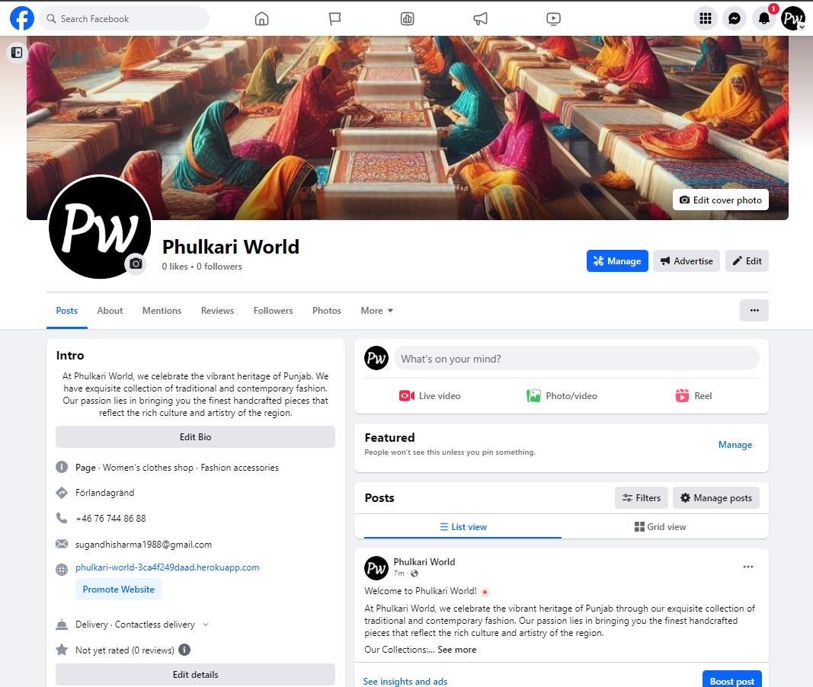
            

            

                
Facebook Page - User View

                
            

## Database Schema

The database schema is composed by 8 models in total under 4 different apps: 

- **About App:**
    - **About:** This model consist of all about us information of this website. Only admin can update this model.
    - **Contact:** This model consist of all contact us information of when a site user writes to the admin. Any site user can update this model regardless of the user is logged in or not.
    - **Faq:** This model consist of all frequently asked question updated by admin on the side. Only admin can update this model.
- Profiles App:
    - **UserProfile:** This model consist of all user profiles that any logged in user create for itself. The user has been identify with the help of django user model to display the correct profile at front end. Site user have access to write information about its profile in this model and all ordered items are added in this model to display at my profile page.
- **Checkout App:**
    - **Order:** This model consist of all order information when a user try to order an item by making a purchase. Various calculations like delivery cost, order total and grand total are calculated while updating this model based upon the prices and quantity of the items purchased by the user.
    - **OrderLineItem:** This model consist of order line items information when a user try to order some item and not yet ordered it. This model helps to display the line item total cost for each item ordered under a single order.
- Product App:
    - **Category:** This model consist of different categories available on website. Only admin have access to this model and access to create a new categories.
    - **Product:** This model consist of all differnt products belongs to different categories available on the website. Only admin have the access to update this model.

# Features

## Common Features

### Language Used

- Django
- Python
- HTML5
- CSS3
- Javascript

### Navbar

- On large screens, the navbar displays brand name in left side, in center along with search bar it shows expandable menu with submenus described below. Also, on right corner of navbar My Account and shopping bag with information of amount of product bought displays. 

    

        
Desktop View

        
    

    - **All Products:** By Price, By Rating, By Category, All Products.

        

            
All Products

            
        

    - **Clothing:** Dupatta, Kurti, Suit, All Clothing.

        

            
Clothing

            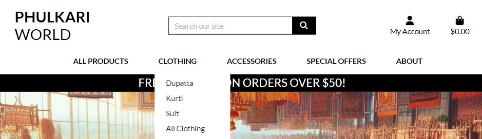
        

    - **Accessories:** Jewelry, Purse, Jutti, All Accessories.

        

            
Accessories

            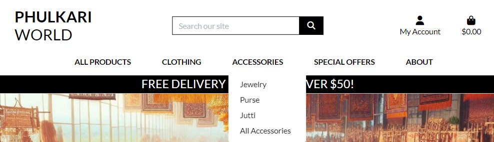
        

    - **Special Offer:** New Arrivals, Deals, Clearance, All Special Offers.

        

            
Special Offer

            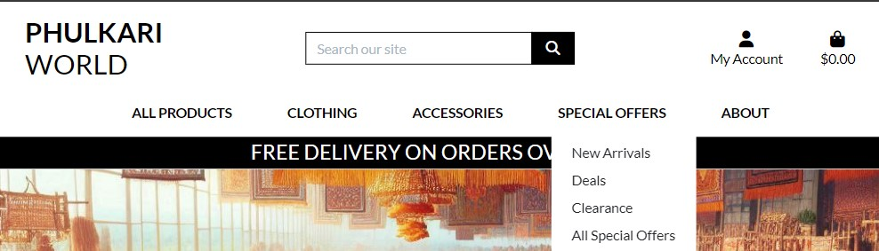
        

    - **About:** About Us, Contact Us, Newsletter, FAQs.

        

            
About

            
        

    - **My Account:**
        - **Without Login:** Register, Login.

            

                
My Account - Without Login

                
            

        - **Customer Login:** My Profile, Logout.

            

                
My Account - Customer Login

                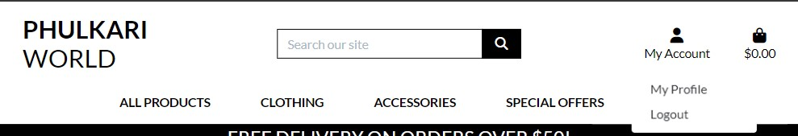
            

        - **Admin Login:** Add New Product, Add New FAQ, Update About Us, My Profile, Logout.

            

                
My Account - Admin Login

                
            

- In small screens, all links are placed within a burger menu. The search icon, My account and shopping bag displays outside the collapseable burger menu.

    

        
Mobile View

            
    

### Footer

- Users have functional links to Facebook, X, Instagram and YouTube. These links will open in a new tab as they are outside the web application. 

    

        
Desktop View

        
    

    

        
Mobile View

            
    

### Index

- The landing page of the website display hero image of the website the shows phulkari weaving womens along with the short description of phulkari and *Shop Now* button. Clicking on *Shop Now* button will route the site user to product catalogue page.

    

        
Home Page - Desktop View

        
    

    

        
Home Page - Mobile View

        
    

- Apart from the user, admin of the website additionally have the admin dashboard. From this the admin can access the different models that are used to store the data in them. Admin can take any kind of add, update, delete actions. At some places the access to admin is also restricted and that will be explained in upcoming steps.

    

        
Admin Dashboard

        
    

### Products - Site User View

- On Products page, all the products in the catalogue appears on random order. Products will be visible with its short details like image (if available, else default no-image image will be visible), product name, price, category, rating.

    

        
Product Page

        
    

- On left side of the page, total products count will be visible and at right side the drop down box with different ways of sorting option will be visible as well. Products can be sorted by name & category (a-z), price & rating (low to high).

    

        
Product Page - Sorting Options

        
    

- When a sorting option is selected then the view of *Product* page changes a bit and all items in catalogue appears accoring to the sorting order selected. Also in the top left corner of the page now before the product count a link to route back to *Product Home* page appears. Sorting drop down box also show that which sorting has been applied.

    

        
Product Page - Sorting Applied

        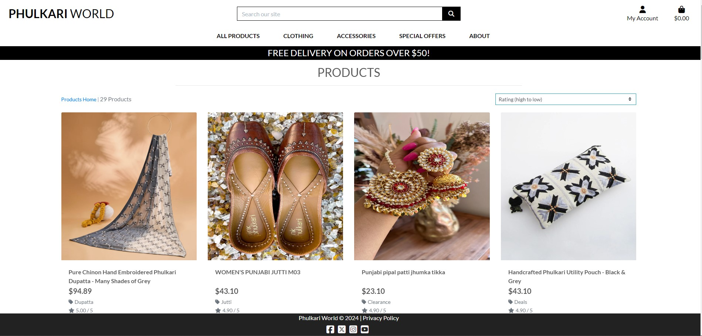
    

- If a category of the product is selected from the nav bar menu then only products w.r.t. that specific category will be displayed on Product page. Also, link to *Product Home* page appears alongside total product count of that category. Sorting drop down box will set to default of no sorting order and a user can choose to select any sorting as we already described under product sorting section above. In the top middle side of the page you can see a button with the name of category as well.

    

        
Product Page - Category

        
    

- If a user try to search for a product by typing something on the search box. All results matches with that searched word will appear on products page. The search functionality will look for the searched word in Product name and description and return the results. Also, link to *Product Home* page appears alongside total product count of that searched word. Sorting drop down box will set to default of no sorting order and a user can choose to select any sorting as we already described under product sorting section above.

    

        
Product Page - Search

        
    

- When a new product is added its starts getting visible on *Product* page.

    

        
Product Page - Newly Added Product

        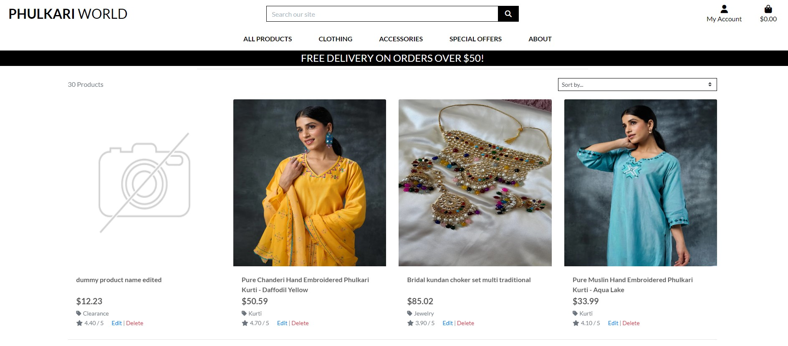
    

### Products - Site Admin View

- On Products page for Admin, everything else will remain same as Products page for site user like products will be visible with its short details like image (if available, else default no-image image will be visible), product name, price, category, rating. Only additional information is that the edit and delete options will be visible for admin user. 

    

        
Product Page - Admin

        
    

- Admin can also access the Products and Categories information from the *'/admin'* Page and also have access to edit or delete the products and category from there.

    

        
Category - Admin View

        
    

    

        
Category - Admin Model

        
    

    

        
Product - Admin View

        
    

    

        
Product - Admin Model

        
    

### Add New Product

- Admin have option to add a new product from the website. The menu is present under *My Account > Add New Product*. If admin adds a product successfully, the website route to *Product Detail* page. If the admin clicks cancel button, the website routes to Products *Home* page.

    

        
Add New Product Page

        
    

- If the form is invalid, error messages will be displayed. 

    

        
Add New Product Page - Error

        
    

- If the form is successfully submitted. A success message will display displayed.

    

        
Add New Product Page - Success

        
    

### Edit Product

- Admin have option to edit an existing product from the website. The options are present under each product on *Product* Page or *Product Detail* Page. If admin edits a product successfully or clicks cancel button, the website route to *Product Detail* page that the user tried to edit.

    

        
Edit Product Page

        
    

- If the form is invalid, error messages will be displayed. 

    

        
Edit Product Page - Error

        
    

- If the form is successfully submitted. A success message will display displayed.

    

        
Edit Product Page - Success

        
    

### Delete Product

- Admin have option to delete an existing product from the website. The options are present under each product on *Product* Page or *Product Detail* Page. When delete option is selected, the product gets deleted from the catalogue and site user is route to Products *Home* page.

    

        
Delete Product

        
    

### Products Detail

- On Products detail page, selected products complete details will be visible like image (if available, else default no-image image will be visible), product name, price, category, rating, description, quantity (with option to increase or decrease), size (only, if the product item has a size). At the end there will be 2 botton, first *Keep Shopping*, if the user clicks on this button then the website takes the user back to Product *Home* page. Second, *Add to Bag* button. If the site user is admin then edit and delete options will be visible as well.

    

        
Product Detail Page

        
    

    

        
Product Detail Page - Admin

        
    

- When user clicks this button the product gets added into the users account and ready for purchase. A popup message will apear in the top right corner under the Shopping bag icon with a button to go for checkout. The popup contains the information like count of items in the bag, product name, image, size, quantity, total amount to pay and go to secure checkout button. If the users adds more then 1 product of different kind then the popup handles multiple products via chaning itself to scrollable popup.
    

        
Product Detail Page - Add to Bag

        
    

- If the user has total price less than the minimum limit for free delivery of the products to user. A message will shop with pop message of shopping bag.

    

        
Product Detail Page - Free Delivery Message

        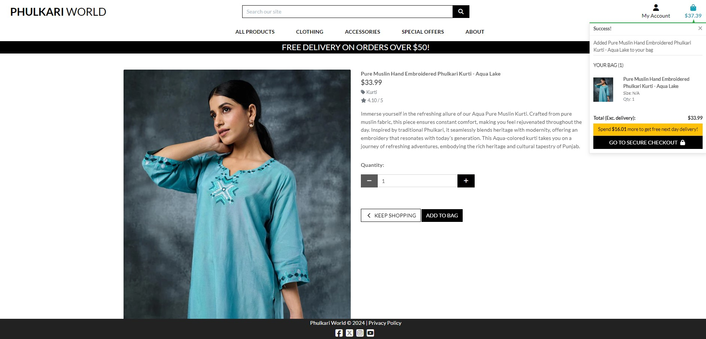
    

### Checkout Page

- Once user is ready to make a purchase and clicked on *Secure Checkout* button on *Shopping Bag* page. The next page open for user is *Checkout* page. In this page the user will see short order summary once again with product image, name, size (if available), quantity, subtotal, order total, delivery charges (if any) and grand total. Also, the user will get option to add the details for delivery of the products like Personal detail (name, email id), delivery details (Phone number, Street Addresses, Town, County, Pin Code, Country (selection from a drop down menu containing list of all countries)),  Payment detail (Card number, expiry date, cvv number and Pincode). If the user is not logged in the a message will appear to login or create account to save the delivery information.

    

        
Checkout Page - Without Login

        
    

- If the user is logged in then an option (checkbox) will be available to the user to save the delivery information. By choosing the saving delivery information email id and delivery details will be stored in the database so that when next time the user logs in they don't have to refil the same information again and again. 

    

        
Checkout Page - With Login

        
    

- At the bottom of screen 2 button will also be available. First *Adjust Bag* button will take the user back to *Shopping Bag* page where user can make adjustments to the order. Second *Complete Order* button, if user selects this button then an order will be placed and order placed successfully message and webpage will open next. Also a confirmation email will be sent to the user.

    

        
Checkout Page - Order Placed

        
    

    

        
Checkout Page - Order Placed Email

        
    

- If the form is invalid, error messages will be displayed. 

    

        
Checkout Page - Error

        
    

### Order Page - Admin

- Admin can also view the order placed on *'/admin'* page. 

    

        
Order Placed - Admin view

        
    

    

        
Order Placed - Admin Model

        
    

    

        
Order Placed - Admin Model

        
    

### Sign Up

- When not authenticated, users can create an account using a unique username and password.

    

        
Signup Page

        
    

- When the user attempts to create an account with an existing username, a password that does not fulfill the requirements, or if the passwords do not match, an error is displayed in the form.

    

        
Signup Error

        
    

- When users fill all details as per required criteria and submit the form. 

    

        
Signup Form Example

        
    

- A *Verify your email address* page open up with the message about the same.

    

        
Signup Verification Email Page

        
    

- A verification email is sent to the user on registered email id. 

    

        
Email Verification Mail

        
    

- When user click on the link provided on the email. *Confirm Email Address* page open up with confirmation button.

    

        
Confirm Email Address

        
    

    

        
Email Confirmation Success

        
    

- When user confirm the email by clicking on *Confirm* button on last page. Signup process completes successfully and *Login* Page open up for user to login using the username/email id and password.

    

        
Signup Success

        
    

- The admin can see all the user who has created their account on website from the User model on django admin page.

    

        
User Model View

        
    

    

        
Email Registered View

        
    

- If the user already have an account and tried to register again. An email will be sent to the user for confirmation if they are trying to create account that already exists along with the link to reset the password if they have forgot it.

    

        
User Already Exists

        
    

- If user clicks on *Forgot Password* link then the corresponding page open up and asks user to confirm its email id to provide password reset link in the email.

    

        
Password Reset Page

        
    

- Once user provide its email id then a reset password link will be sent to user's email account and a confirmation message will display to the user.

    

        
Password Reset Email Sent

        
    

- The user recevies a password reset link via email on its email account.

    

        
Password Reset Email

        
    

- Once user clicks on password reset link. A webpage open up and asks user to add a new password and confirm it.

    

        
Change Password Page

        
    

- Once user enter correct password in both boxes and follow all validation rule for password. Password reset successfully message comes up.

    

        
Password Change Success

        
    

### Sign In

- Signin Page: A user can sign in to the application by entering their username and correct password.

    

        
Signin Page

        
    

- If, when signing in, the user inputs an incorrect username or password, the form will display the error.

    

        
Signin Error

        
    

### Sign Out

- Signout Page: Here, the application asks the user for confirmation before signing out. 

    

        
Signout Page

        
    

### My Profile 

- Site user has option to view its profile using *My Profile* menu under *My Account*. The profile page consist of user order history with short summary of orders like Order Number with a link for order details, Date of order, Names of items order, Order Total cost. Also, on My Profile page the user can view its personal details like username and email id, deafult delivery information like phone number, street address, city, county, pin code, and country information. The user also have option to update the information.

    

        
My Profile Page

        
    

- Then the user can create its profile by filling the information like the firstname, lastname, email id, profile image and writing few lines about itself under describe yourself text box.

    

        
Update Profile

        
    

- If any incorrect information is filled then the user wil face error.

    

        
Profile Form Error

        
    

### About Us 

- This is an informational page that includes a brief description of the website, the story of business and collections of different items the website have. It also give some promises to gain the trust of customer and encourges the user to explore the website.

    

        
About Us Page

        
    

- Only the admin of the website has authorization to update the about us page content. Admin can update it either from *'/admin'* page or directly from the website using *'Update About Us'* page. When admin clicks on 'Update About Us' page then the update about us page open and a message display to the user that the page is going to be edited. After editing the information on About Us form, if admin clicks on *Update About Us* button then the *About Us* page will start displaying the updated information as well as a successfully updated page message. But if the admin clicks *Cancel* button the website will route the site admin to *Home* page.

    

        
Update About Us Page

        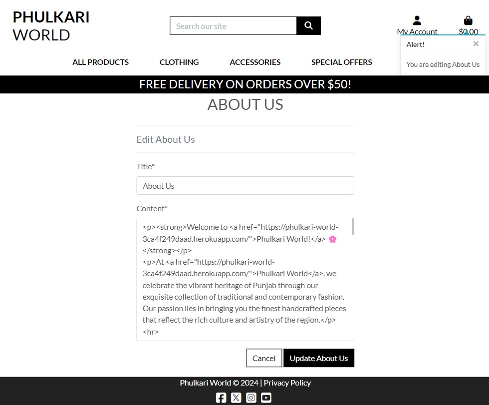
    

    

        
Update About Us Page - Success

        
    

    

        
About Us Page - Admin

        
    

    

        
About Us Model - Admin

        
    

### Contact Us

- This page contains a form for a user to directly contact the admin. The fields include name, email and message. 

    

        
Contact Us Page

        
    

- If the form is invalid, error messages will be displayed. 

    

        
Contact Us Page - Error

        
    

- If the form is successfully submitted. A success message will display displayed.

    

        
Contact Us Page - Success

        
    

- The admin of the website can see the different message posted by the users using the contact us form. The admin also has the option to mark the message as read using the check-box option in the contact model. This will help the admin to track how many message he has already read and/or responded. 

    

        
Contact Us Page - Admin

        
    

    

        
Contact Us Model - Admin

        
    

### FAQ

- This page contains a number of frequently asked questions (FAQ) by site users. It contains the list of generic questions and their answer that are common for all site users and doesn't need site owner intervention specifically. If the site user have any specific question , they can reach using *'Contact Us'*'* page. 

    

        
FAQ Page

        
    

- When admin opens the same FAQ Page. The 'Edit' & 'Delete' links get visible below each FAQ question/answer. Admin can reach edit FAQ page by clicking on *Edit* link or Delete a sepecific FAQ by clicking the *Delete* link.

    

        
FAQ Page - Admin

        
    

- The admin of the website can see add more FAQ's or edit/delete exsting FAQ's. The admin can do this from either website if logged in as admin from *'Add New FAQ'* page or from *'/admin'* site. 

    

        
Add New FAQ Page

        
    

    

        
Edit FAQ Page

        
    

    

        
FAQ Page - Admin

        
    

    

        
FAQ Model - Admin

        
    

- If the FAQ added successfully. A success message will display displayed.

    

        
FAQ Page - Success

        
    

- If the FAQ edited successfully. A success message will display displayed.

    

        
FAQ Edit Page - Success

        
    

- If the FAQ deleted successfully. A success message will display displayed.

    

        
FAQ Delete Page - Success

        
    

### Newsletter

- This page contains a form for a user to directly contact the admin. The fields include name, email and message. 

    

        
Newsletter Page

        
    

- If the form is invalid, error messages will be displayed. 

    

        
Newsletter Page - Error

        
    

- If the form is successfully submitted. A success message will display displayed.

    

        
Newsletter Page - Success

        
    

- The admin of the website can see the list of all subscribers those have subscribed for the newsletter using Mailchimp account.

    

        
Mailchimp Page - Admin

        
    

- We have created a template for sending a thanks email to all customers who subscribed for the newsletter and introuducing the business to them using Mailchimp account.

    

        
Subscriber Thanks Email - Admin

        
    

    

        
Subscriber Thanks Email - Configuration

        
    

    

        
Subscriber Thanks Email - User

        
    

- I've also created a customer journey using the Mailchimp account. This will help to send an automated welcome email to every new newsletter subscriber. But because its a paid service, hence its not functional at them moement.

    

        
Subscriber Welcome Email - Customer Journey

        
    

## Future Features

- Asynchronous behaviour
    - If user clicks on back or forward button from the browser the session remains active. I would like to handle this issue in future release.

- Reduce quantity button not disable automatically on desktop screens
    - While testing a bug has been found that on *Shopping Bag* page the minus (-) sign is not disabling on quantity box when count of quantity reach 1. This feature is working on mobile (smaller screens). I would like to fix this issue in future release.

- User can enter characters in phone number field on checkout page
    - While testing a bug has been found that the user can enter characters in phone number field in checkout page. I would like to fix this issue in future release.

- Further relevant feedback
    - Implement autohide notifications.
    - Implement rating to be provided by the user.
    - Implement review by the user feature for product bought by the user.

# Testing

## Methodology 

Testing was an integral part of the project development, encompassing the use of Django debug pages and strategically placed print statements to verify the functionality of the code at various stages. Furthermore, a comprehensive testing approach was adopted, outlined below. This involved meticulous manual testing to ensure alignment with all user stories and acceptance criteria.

### Index Page

| Testing  | Steps | Expected Outcome | Results |  
| - | - | - | - |
| Navigation bar functionality (user not authenticated) | Click all available links | Apart from product catalogue navbar the user can only see signup and login links. | PASS |
| Navigation bar functionality (user authenticated) | Click all available links | Apart from product catalogue navbar links and the user can see My Profile and Signout links. | PASS |
| Navigation bar functionality (Admin authenticated) | Click all available links | Apart from product catalogue navbar links and the admin can see Add New Product, Add New FAQ, Update About Us, My Profile and Signout links. | PASS |
| Footer links | Click all available social media links | User is directed to respective social media pages.  | PASS |
| Shop Now link | Click Shop Now link | User is redirected Product page with a catalogue of all products.  | PASS |

### Product Page

| Testing  | Steps | Expected Outcome | Results |  
| - | - | - | - |
| Product Page - User View | A list of all products should be visible | When user reach product page, the page should display all type of products on website with the information like product image (if available, else show default no-image image), product name, rating, price and category. Also, clicking on the product image should route to Product detail page. | PASS |
| Product Page - Admin View | A list of all products should be visible with option to edit or delete the product | When admin reach product page, the page should display all type of products on website with the information like product image (if available, else show default no-image image), product name, rating, price and category. Also, clicking on the product image should route to Product detail page. For admin, the link to edit or delete the product should be visible too. | PASS |
| Product Page - Sorting Options | Various type of sorting available | When user reach product page, the page should display the user option to sort the product by various ways like name, category, price or rating. | PASS |
| Product Page - Searching Options | User the search box to searching a product | When user try to search a product by writing a word in search box, the product page should display all the product matches that word regardless of the word existing in product name or description. | PASS |
| Product Page - Category Selections | User selects a specific category from the navbar | When user try select a specific category of product from the navbar. Only the products belongs to that category should be visible. | PASS |

### Product Detail Page

| Testing  | Steps | Expected Outcome | Results |  
| - | - | - | - |
| Product Detail Page - User View | Individual product should be visible | When user reach product detail page, the page should display the detailed information of the product like product image (if available, else show default no-image image), product name, rating, price, category, description, size (if available) and option to increase or decrease quantity. Also, the page should have button like Keep Shopping to continue more shopping or add the product to shopping bag. | PASS |
| Product Detail Page - Admin View | Individual product should be visible | When user reach product detail page, the page should display the detailed information of the product like product image (if available, else show default no-image image), product name, rating, price, category, description, size (if available) and option to increase or decrease quantity. Also, the page should have button like Keep Shopping to continue more shopping or add the product to shopping bag. For admin, the link to edit or delete the product should be visible too. | PASS |

### Add New Product Page

| Testing  | Steps | Expected Outcome | Results |  
| - | - | - | - |
| Add New Product | Add new product as admin | Only when admin logs in the user should get options to Add New Product from the website. If user enters all required information correctly then the new product should be added successfully and starts getting visible on Product catalogue to all users. | PASS |
| Add New Product - Validation check | Add new product incorrectly as admin | If any validation fail when the admin trying to add a new product then an error message should displays to the user and askes it to correct it. | PASS |

### Edit Product Page

| Testing  | Steps | Expected Outcome | Results |  
| - | - | - | - |
| Edit Product | Edit existing product as admin | Only when admin logs in the user should get options to edit existing product from the website *Product* or *Product Detail* pages. If user enters required information correctly then the edit should be update successfully and starts getting visible on Product catalogue to all users. | PASS |
| Edit Product - Validation check | Edit existing product incorrectly as admin | If any validation fail when the admin trying to edit an existing product then an error message should displays to the user and askes it to correct it. | PASS |

### Delete Product

| Testing  | Steps | Expected Outcome | Results |  
| - | - | - | - |
| Delete Product | Delete existing product as admin | Only when admin logs in the user should get options to delete existing product from the website *Product* or *Product Detail* pages. If user deletes an existing product then the product should be removed from the Product catalogue for all users. | PASS |

### Sign Up Page

| Testing  | Steps | Expected Outcome | Results |  
| - | - | - | - |
| User sign-up page  | Page should display the sign up form | A verification email will be sent to the User on its registered email account. | PASS |
| User sign-up page  | Email verification | The user should receive a verification email with link to verify its email account. On clicking the link user should route back on the website with confirm email button. When user verifies email then the user should be able to login on the website with its account. | PASS |
| User sign-up - Form validation  | Submit an empty form. | Browser promts that required fields need to be filled. | PASS |
| User sign-up - Form validation  | Submit an incomplete form. | Browser promts that required fields need to be filled. | PASS |
| User sign-up - Form validation  | Submit an invalid password. | Form promts the errors in the password. | PASS |
| User sign-up - Form validation  | Submit non-matching invalid password. | Form promts the error. | PASS |
| User sign-up - Form validation  | Submit an exisiting user name. | Form promts that the username is already taken error. | PASS |
| User sign-up - Form validation  | Submit an exisiting email id. | An email should be sent to the user registered email account with message that someone trying to login already existing email account. Along with this a forgot password link should be provided in the email to provide the option to reset the password. | PASS |

### Log In Page

| Testing  | Steps | Expected Outcome | Results |  
| - | - | - | - |
| User login page  | Page should display the login form | User is successfully directed to the login page and sees the login form. | PASS |
| User login page - Form validation | Submit an incorrect username password | Form promts that the username and/or password is not correct. | PASS |
| User login page - Forgot Password | Click on forgot password link | The user should be able to reset the password by confirming its email id. An email should be sent to the user when the user enteres after clicking on forgot password. The email should contains the link to reset the password. When user clicks on the reset password link in the email, the user routes back on website with option to reset its password. After resetting the password the user should be able to signin on the website with new password only. | PASS |

### Log Out Page

| Testing  | Steps | Expected Outcome | Results |  
| - | - | - | - |
| User logout page  | Page should display the logout reconfirm message | User is successfully directed to the logout page and sees the logout reconfim message with logout button. | PASS |
| User logout page - Form validation | Click in logout | User is successfully logged out and a display message is displayed at the top. | PASS |

### My Profile Page

| Testing  | Steps | Expected Outcome | Results |  
| - | - | - | - |
| My profile page | As a user click on My Profile link under My Account on navbar | The user profile should be visible containing the user registered delivery information, if already added. Also the page should contains the list of all the orders ordered by the user. | PASS |
| My profile page - Update delivery information | User updates the delivery information | If user changes any information under delivery information form and click on update information. The new information should be visible by default on checkout page while ordering an item from product catalogue. | PASS |
| Add profile - Form validation | Submit an incomplete form. | Browser promts that required fields need to be filled. | PASS |
| Add profile - Form validation | Submit a valid form. | A success message is displayed. | PASS |

### About Us Page

| Testing  | Steps | Expected Outcome | Results |  
| - | - | - | - |
| About us info | Goto about us page and see about us page info and updated on datetime | The latest about us info displays and the correct updated on datetime is visible on the page. | PASS |
| Update About us | Goto Update about us page as admin and udpate some info on the page | The latest about us info displays and the correct updated on datetime is visible on the page. | PASS |

### Contact Us Page

| Testing  | Steps | Expected Outcome | Results |  
| - | - | - | - |
| Contact Us form - Form Validation | Submit empty form | Browser promts that required fields need to be filled. | PASS |
| Contact Us form - Form Validation | Submit with an invalid email address | Error message is successfully displayed. | PASS |
| Contact Us form - Form Validation | Submit valid form | User is redirect to success page stating that the response has been recorded. | PASS |

### FAQ Page

| Testing  | Steps | Expected Outcome | Results |  
| - | - | - | - |
| FAQ info | Goto FAQ page and see FAQ list | The latest FAQ info displays on the page. | PASS |
| Add New FAQ | Goto Add New FAQ page as admin and add new FAQ | The latest added FAQ displays on the FAQ page to all users. | PASS |
| Edit/Delete FAQ links | Goto FAQ page as admin | The admin should see Edit and Delete link under each FAQ when visit the FAQ page. | PASS |
| Edit FAQ | Goto FAQ page as admin and edit an existing FAQ | The latest added FAQ information displays on the FAQ page to all users. | PASS |
| Delete FAQ | Goto FAQ page as admin and delete an existing FAQ | The deleted FAQ information removed from the FAQ page for all users. | PASS |

### Newsletter

| Testing  | Steps | Expected Outcome | Results |  
| - | - | - | - |
| Newsletter | Goto Newsletter page and subscribe for newsletter | When a user subscribe by providing email id for newsletter. The user email id should be stored in Mailchimp account. The admin have option to send welcome email manually for any newly registered user. The admin should be able to create future campains as well on Mailchimp. | PASS |

## Validator Testing 

### W3C Validator

#### Index Page

- Errors found for same name meta tags and some id nameing related. Fixed them by updating the respective html file.

    

        
Index Page - Error

        
    

    

        
Index Page - Success

        
    

#### Product Page

- No errors found.

    

        
Product Page - Success

        
    

#### Product Detail Page

- No errors found.

    

        
Product Detail Page - Success

        
    

#### Add Product Page

- No errors found, only one info that I couldn't find to fix.

    

        
Add Product Page - Error

        
    

#### Shopping Bag Page

- No errors found.

    

        
Shopping Bag Page - Success

        
    

#### Checkout Page

- No errors found.

    

        
Checkout Page - Success

        
    

#### About Us Page

- Errors found for the user of center html tag. Fixed them by removing that from respective html file.

    

        
About Us Page - Error

        
    

    

        
About Us Page - Success

        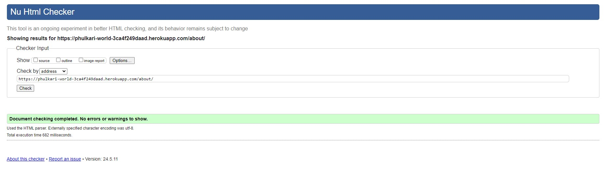
    

#### Update About Us Page

- No errors found, only one info that I couldn't find to fix.

    

        
Update About Us Page - Error

        
    

#### Contact Us Page

- No errors found.

    

        
Contact Us Page - Success

        
    

#### FAQ Page

- Errors found for aria-controls to match with similar id in the file. Fixed them by updating the respective html file.

    

        
FAQ Page - Error

        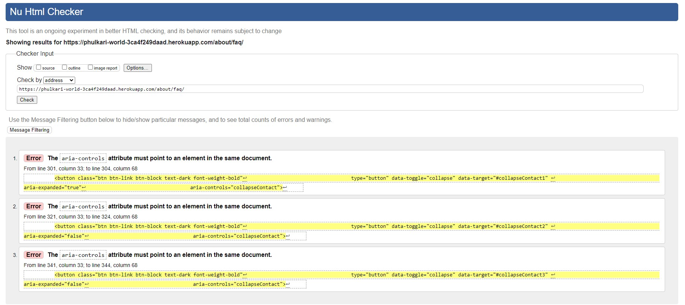
    

    

        
FAQ Page - Success

        
    

#### Edit FAQ Page

- No errors found, only one info that I couldn't find to fix.

    

        
Edit FAQ Page - Error

        
    

#### My Profile Page

- No errors found, only one info that I couldn't find to fix.

    

        
My Profile Page - Error

        
    

#### Newsletter Page

- Errors found for javascript code. Fixed them by updating the javascript code in the respective html file.

    

        
Newsletter Page - Error

        
    

    

        
Newsletter Page - Success

        
    

### CSS Validator

- No error found.

    

        
CSS Validation - Success

        
    

### JavaScript (JSHint) Validator

#### Product Page

- No errors found.

    

        
Product Page - Success

        
    

#### Shopping Bag Page

- No errors found.

    

        
Shopping Bag Page - Success

        
    

#### Checkout Page

- No errors found.

    

        
Checkout Page - Success

        
    

#### Checkout Page

- No errors found.

    

        
Profile Page - Success

        
    

### Python (PEP8) Validator

- Validated all *.py pages on website and fixed the warning based upon suggestion for PEP8 tool. Mostly the warnings are related to training whitespace or length exceed. No code bug found.

 

### Lighhouse Validator

- Page has an good rating in Lighthouse. 

- Desktop

 

- Mobile

# Frameworks, Libraries and Programs Used

- [Google Fonts](https://fonts.google.com/) 
- [Favicon](https://favicon.io/)
- [Bootstrap 5](https://getbootstrap.com/docs/5.3/getting-started/introduction/)
- [Github](https://github.com/juanovt10)
- [Gitpod](https://gitpod.io/workspaces)
- [Heroku](https://id.heroku.com/login)
- [Django](https://www.djangoproject.com/)
- [AWS cloud storage](https://eu-north-1.console.aws.amazon.com/console/home?nc2=h_ct&src=header-signin&region=eu-north-1)
- [Django-allauth](https://docs.allauth.org/en/latest/)
- [ElephantSQL](https://customer.elephantsql.com/)
- [Guinicorn](https://gunicorn.org/)
- [Psycopg](https://www.psycopg.org/docs/)
- [Temp mail](https://temp-mail.org/) - For generating temp email addresses
- [Balsamiq](https://balsamiq.com/) - For wireframes 
- [Lucidchart](https://lucid.app/users/login#/login) - For database diagram 
- [Microsoft Copilot](https://copilot.microsoft.com/) - For generating imaginary profiles of users and about us page
- [MailChimp](https://login.mailchimp.com/) - For newsletter subscription
- [Privacy policy generator](https://www.privacypolicygenerator.info/)
- [Sitemap generator](https://www.xml-sitemaps.com/)
- [Stripe Payment](https://dashboard.stripe.com/test/dashboard) - For handling payment system
- [JSHint](https://jshint.com/) - For testing javascript code
- [CSS Validator](https://jigsaw.w3.org/css-validator/) - For CSS code verification
- [W3C Validator](https://validator.w3.org/) - For HTML code validation
- [PEP8 - CI Python Linter](https://pep8ci.herokuapp.com/#) - For python code validation
- [Am I Responsive](https://ui.dev/amiresponsive) - For webpage validation on different screen sizes

## Deployment

### How to Fork

To fork the repository:
1. Log in (or sign up) to Github.
2. Go to the repository for this project.
3. Click the Fork button in the top right corner.
   
### How to deploy

How to deploy the repository:
1. On terminal:
   - Install all the necessary applications:
        - Install dj_database_url and psycopg2:

                pip3 install dj_database_url==0.5.0 psycopg2

        - Install Django and gunicorn:

                pip3 install 'django<4' gunicorn

        - Install storages package:

                pip3 install django-storages

        - Create requirements file:

                pip3 freeze --local > requirements.txt
   
2. Create the new Database:
    - In your settings.py file, import dj_database_url underneath the import for os:
        
            import os
            import dj_database_url
    
    - Scroll to the DATABASES section and update it to the following code, so that the original connection to sqlite3 is commented out and we connect to the new ElephantSQL database instead. Paste in your ElephantSQL database URL in the position indicated:

            # DATABASES = {
            #     'default': {
            #         'ENGINE': 'django.db.backends.sqlite3',
            #         'NAME': os.path.join(BASE_DIR, 'db.sqlite3'),
            #     }
            # }
           
            DATABASES = {
            'default': dj_database_url.parse('your-database-url-here')
            }

        **DO NOT commit this file with your database string in the code, this is temporary so that we can connect to the new database and make migrations. We will remove it in a moment.**

    - In the terminal, run the showmigrations command to confirm you are connected to the external database:

            python3 manage.py showmigrations
    
    - If you are, you should see a list of all migrations, but none of them are checked off.

    - Migrate your database models to your new database:

            python3 manage.py migrate
    
    - Load in the fixtures. Please note the order is very important here. We need to load categories first:

            python3 manage.py loaddata categories

    - Then products, as the products require a category to be set:

            python3 manage.py loaddata products

    - Create a superuser for your new database:

            python3 manage.py createsuperuser

    - Follow the steps to create a your superuser username and password. The email address can be left blank.
    - Finally, to prevent exposing our database when we push to GitHub, your DATABASE in the settings.py file should look like this:

            if 'DATABASE_URL' in os.environ:
                DATABASES = {
                'default': dj_database_url.parse(os.environ.get('DATABASE_URL'))
                }
            else:
                DATABASES = {
                    'default': {
                        'ENGINE': 'django.db.backends.sqlite3',
                        'NAME': os.path.join(BASE_DIR, 'db.sqlite3'),
                    }
                }

3. On [Elephantsql](https://customer.elephantsql.com/login):
    - Log in/or create an account to access your ElephantSQL account
    - Click “Create New Instance”
    - Set up your plan:
    - Give your plan a Name (this is commonly the name of the project)
    - Select the Tiny Turtle (Free) plan
    - You can leave the Tags field blank
    - Click “Select Region”
    - Click “Review”
    - Return to the ElephantSQL dashboard and click on the database instance name for this project
    - Copy your ElephantSQL database URL using the Copy icon. It will start with postgres://
  
4. On [AWS - Amazon](https://eu-north-1.console.aws.amazon.com/console/home?nc2=h_ct&src=header-signin&region=eu-north-1):
    - Log in/or create an account to access your AWS account
    - On AWS page go to S3
    - Click on create new bucket
    - Create a name (best to be the same as Heroku) and select region.
    - Select ACLs Enabled and Bucket owner preferred
    - Deselect all "Block all puclic access"
    - Confirm the yellow alert
    - Click on create bucket
    - Click on the new bucket
    - Click on the Properties tab
    - Scroll to the bottom of the page and on static website hosting click on edit
    - Select “enable” static website hosting, then add the text “index.html” and “error.html” to index document
    - Save changes
    - Still on bucket, click on permissions tab
    - Scroll to the bottom of the page, on CORS Cross-origin resource sharing (CORS), click on edit and paste the below then save.

            [
                {
                    "AllowedHeaders": [
                        "Authorization"
                    ],
                    "AllowedMethods": [
                        "GET"
                    ],
                    "AllowedOrigins": [
                        "*"
                    ],
                    "ExposeHeaders": []
                }
            ]
      
    - On Bucket policy click on edit and click o policy generator
    - It will open a new tap, and then needs to fill the below:
        - Type of policy: S3 Bucket policy
        - Principal: *
        - Action: Get object
        - ARN: Copy from the AWS page on bucket policy
    - Click add statement and then generate policy
    - Copy the policy
    - Paste the policy on the bucket page, add “/*” at the end of resource link and save.
    - On Access control list (ACL), click on edit and select everyone (public access)
    - Select the “I understand box” and save.
    - Now, search for IAM and click on the dashboard click on User groups
    - Give it a name and press create group
    - On the dashboard click on policies and create policy
    - Click on JSON then on import policy
    - Write “S3” on the search menu and select AmazonS3FullAccess then click on Import policy
    - Add the ARN (From bucket page) on the resource twice but on the second link add “/*” and the click on next
    - Give the policy a name and a description and click on create policy
    - Go back to User groups, click on the group you created and then click on permissions, add permissions and attach policies.
    - Find you policy by the name and attach
    - On the dashboard click on users.
    - Create a new user
    - Give the user a name and click next
    - Select the group and click next and create user
    - On the users menu, click on the user you created
    - Click on create access key
    - Select application running on an AWS compute service, click on the box “I understand” and click next
    - Leave the description blank and click on create access key
    - Download the CSV file
    - On the CSV file from AWS you will find the SECRET KEY and ACCESS KEY, that needs to be added on Heroku as well the USE AWS set to TRUE.

5. On [Stripe](https://stripe.com/ie):
     
    - Log in/or create an account to access your Stripe account
    - On your dashboard you will have your test API key that you will need to add on your Heroku.

6.	On [Heroku](https://id.heroku.com/login):
    - Login/or create an account to access your Heroku account
    - Create new Heroku App
    - Open the settings tab
    - Click Reveal Config Vars
        - Add a Config Var called DATABASE_URL: The value should be the ElephantSQL database url you copied from step 3.
        - Add a Config Var called SECRET_KEY: The value should be of your choice, but keep to secret. (Should be the same as set on your env.py file)
        - Add a config Var called AWS_ACCESS_KEY_ID: The value should be the AWS access key from step 4.
        - Add a config Var called AWS_SECRET_ACCESS_KEY: The value should be the AWS secret access key from step 4.
        - Add a config Var called STRIPE_PUBLIC_KEY: The value should be the Stripe public key from step 5.
        - Add a config Var called STRIPE_SECRET_KEY: The value should be the Stripe secret key from step 5.
        - Add a config Var called USE_AWS: the value should be "True"

7. On your settings.py:

    - Reference env.py by adding on the top:
    
            import os
            import dj_database_url
            if os.path.isfile("env.py"):
            import env

    - Remove the insecure secret key (if any) and replace with:
    
            SECRET_KEY = os.environ.get('SECRET_KEY')
        
    - Add new DATABASES Section:

            if 'DATABASE_URL' in os.environ:
                DATABASES = {
                'default': dj_database_url.parse(os.environ.get('DATABASE_URL'))
                }
            else:
                DATABASES = {
                    'default': {
                        'ENGINE': 'django.db.backends.sqlite3',
                        'NAME': os.path.join(BASE_DIR, 'db.sqlite3'),
                    }
                }

    - Add ‘storages’ to installed apps:

            INSTALLED_APPS = [
                'django.contrib.admin',
                'django.contrib.auth',
                'django.contrib.contenttypes',
                'django.contrib.sessions',
                'django.contrib.messages',
                'django.contrib.staticfiles',
                'django.contrib.sites',
                'allauth',
                'allauth.account',
                'allauth.socialaccount',
                'home',
                'products',
                'bag',
                'checkout',
                'profiles',
                'about',
                'newsletter',

                # Other
                'crispy_forms',
                'storages',
            ]

    - Add AWS section for the static files and media:

                if 'USE_AWS' in os.environ:
                # Cache control
                AWS_S3_OBJECT_PARAMETERS = {
                    'Expires': 'Thu, 31 Dec 2099 20:00:00 GMT',
                    'CacheControl': 'max-age=94608000',
                }
            
                # Bucket Config
                AWS_STORAGE_BUCKET_NAME = 'phulkari-world'
                AWS_S3_REGION_NAME = 'eu-north-1'
                AWS_ACCESS_KEY_ID = os.environ.get('AWS_ACCESS_KEY_ID')
                AWS_SECRET_ACCESS_KEY = os.environ.get('AWS_SECRET_ACCESS_KEY')
                AWS_S3_CUSTOM_DOMAIN = f'{AWS_STORAGE_BUCKET_NAME}.s3.amazonaws.com'
            
                # Static and media files
                STATICFILES_STORAGE = 'custom_storages.StaticStorage'
                STATICFILES_LOCATION = 'static'
                DEFAULT_FILE_STORAGE = 'custom_storages.MediaStorage'
                MEDIAFILES_LOCATION = 'media'

                # Override static and media URLs in production
                STATIC_URL = f'https://{AWS_S3_CUSTOM_DOMAIN}/{STATICFILES_LOCATION}/'
                MEDIA_URL = f'https://{AWS_S3_CUSTOM_DOMAIN}/{MEDIAFILES_LOCATION}/'
                    
        - Tell Django to use AWS to store media and static files:
        
                # Static and media files
                STATICFILES_STORAGE = 'custom_storages.StaticStorage'
                STATICFILES_LOCATION = 'static'
                DEFAULT_FILE_STORAGE = 'custom_storages.MediaStorage'
                MEDIAFILES_LOCATION = 'media'

                # Override static and media URLs in production
                STATIC_URL = f'https://{AWS_S3_CUSTOM_DOMAIN}/{STATICFILES_LOCATION}/'
                MEDIA_URL = f'https://{AWS_S3_CUSTOM_DOMAIN}/{MEDIAFILES_LOCATION}/'

        - Change the templates directory to TEMPLATES_DIR:

            TEMPLATES = [
                {
                    'DIRS': [
                        os.path.join(BASE_DIR, 'templates'),
                        os.path.join(BASE_DIR, 'templates', 'allauth')
                    ],
                },
            ]

    - Add Heroku Hostname to ALLOWED_HOSTS:

            ALLOWED_HOSTS = ["**PROJ_NAME**.herokuapp.com", "**YOUR_HOSTNAME**"]

8. Create a Procfile on the top level directory, and add the code below inside:

        web: gunicorn **PROJ_NAME**.wsgi

9. Create the env.py file on the top level directory, and add the secret keys:

        import os
            os.environ['DATABASE_URL'] = 'your postgres key'
            os.environ['SECRET_KEY'] = 'your secret key'
            os.environ['DEVELOPMENT'] = 'your development key'
    
10. Make sure you have debug set to False on Settings.py:

            DEBUG = False

11. Commit your changes to github:

            git add .
            git commit -m "YOUR MESSAGE"
            git push

12. On Heroku, you can manually deploy it our set up an automatic deployment.
   
13. The live link can be found here [Phulkari World](https://phulkari-world-3ca4f249daad.herokuapp.com/)

# Credits

## Design

The site type is same as the e-commerce website tought in the project 5 'Boutiqe Ado'.
Additionally, the [Bootstrap 5](https://getbootstrap.com/docs/5.2/getting-started/introduction/) framework was heavily used for the front-end development.

## Code

This is a very interesting w.r.t. the learning I had while working on this project. I was fascinated how the real world website works as I was working on this project and understood the background work of e-commerce websites. I really enjoyed the flexibility Django provide w.r.t. writing the custom and efficient codes and integrate database as backend and forms/views in the front end and make it all works smooothly.

So, out of many chanllenges I faced to handle all of them a thumb rule I kept on working is to align with Code Institute Building E-Commerce Platform (Boutiqe Ado) and it has been the biggest help for me in the journey.

Apart from this I faced a challenges regarding configuration of Django country app. Here I received the help from [Django Project](https://code.djangoproject.com/ticket/35046#comment:4) tutorial. It helped me to understand and fix the challenge.

I faced issue with the signout functionality for any signed in user. I tried to match the my code with Boutiqe Ado Project code, looked into slack for solutions if someone already faced the issue as well as search on internet but nothing concrete I've found. I figured out that there is some difference in allauth settings in Boutiqe Ado project vs mine. But another challenge was there was no error in functionality. I was receiving status code 200 but the webpage was not moving onto signout page. When I reached the Tutor support the helped me to understand that I was using Django version 5. That means I was also using a later version of allauth and hence my sign out template was different from the Boutiqe Ado Project. Support team suggested me to revert to the versions as per Boutiqe Ado Project. I did the same and un-installed the latest Django version I had and installed Django==3.2.3. That helped me to fix the issue.

Next challenge I faced while working on order confirmation email feature. I configured everything as instructed in Boutiqe Ado Project but still that was not working. I looked into internet, slack community post and did some trail and run techniques but nothing worked. Then I took help from Tutor support and found the root cause of the problems were: 

- Incompatiblity between Django 3.2, which I was using, and Python 3.12, which heroku uses by default to build project. I have fixed it by reinstalling old version or Paython (python-3.11.9)
- I haven't applied latest change in strip webhook handler given extra in Project. 

In this project I also found good help from my mentor Martina, slack communities too.

In the end, I would like to mention that the all products, its images, name and descriptions I have picked directly from websites mentioned below rather then creating on my own to save time. Some inforamtion about the product like price and ratings etc are a bit modified as well. 

- [phulkariforever](https://www.phulkariforever.com/)
- [etsystatic](https://i.etsystatic.com/)
- [meharpunjabdesigns](https://meharpunjabdesigns.com/)
- [pinkphulkari](https://pinkphulkari.com/)

Apart from this I have used Microsoft Co-pilot to generate imaginary description text of About Us and FAQ pages.
